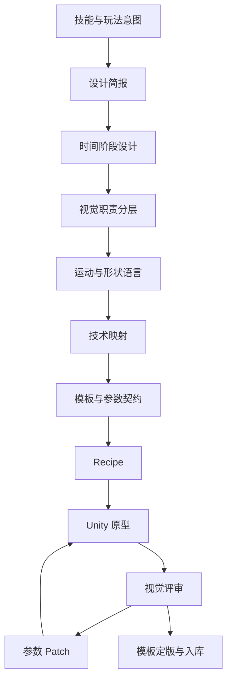

# VFX Composer 设计路线

> 文档状态：v1.0 设计基线；2D 金样与 3D 语义扩展已通过评审  
> 设计范围：Unity 2D 火球 MVP，随后扩展 Unity 3D  
> 基线勘定：Unity 版本已定版 **2022.3.62f3c1 + URP 14.x**  
> 关联文档：[技术开发计划](DEVELOPMENT_PLAN.md) · [项目计划](PROJECT_PLAN.md) · [执行计划](EXECUTION_PLAN.md)

## 1. 为什么需要独立设计路线

开发计划解决“系统如何实现”，项目计划解决“工作如何推进”，设计路线解决以下问题：

- 用户到底要设计什么特效。
- 特效如何从文字变成可执行的视觉方案。
- 视觉阶段、模块和模板如何定义。
- 一个模板应开放哪些参数，哪些结构不允许 AI 修改。
- 2D 与 3D 如何共享语义而不强行共享实现。
- 工具界面如何让用户审查、修改和预览结果。
- 怎样判断一个特效在视觉上“通过”。

因此，VFX Composer 的设计不是单一 UI 设计，也不是单一粒子美术设计，而是四条相互约束的设计线：

1. 特效语义设计。
2. 视觉与时间设计。
3. 模板与参数设计。
4. 工具交互设计。

## 2. 总设计目标

### 2.1 设计目标

1. 把模糊的自然语言需求转化为可审查的视觉方案。
2. 让特效设计先确定阶段、视觉职责和节奏，再选择 Unity 技术。
3. 让模板具有明确美术职责、参数范围和性能级别。
4. 让 AI 的创造空间存在于受控组合和参数中，而不是任意破坏资产。
5. 让用户可以看懂“为什么生成了这些模块”。
6. 让 2D 火球成为完整的设计样板，而不是一次性 Demo。
7. 为后续 Impact、Slash、Aura、Area、Beam 建立可重复设计方法。

### 2.2 设计非目标

- 第一版不追求覆盖所有美术风格。
- 第一版不提供通用节点编辑器。
- 第一版不取代专业特效美术的精修工作。
- 第一版不把“粒子更多”视为“质量更高”。
- 第一版不让 AI 自由生成 Shader 代码。
- 第一版不自动修改玩法数值。

## 3. 设计体系



### 3.1 特效语义层

描述“它在游戏中是什么”：

- Archetype：Projectile、Impact、Slash、Aura 等。
- Dimension：2D 或 3D。
- Element：Fire、Ice、Lightning 等。
- Style：Stylized、Realistic、Pixel 等。
- Motion：Linear、Homing、Arc、Stationary 等。
- Gameplay Role：攻击、治疗、增益、警告、环境等。

### 3.2 时间阶段层

描述“什么时候发生”：

- Anticipation：预兆。
- Launch：释放。
- Travel：飞行或持续。
- Impact：命中。
- Aftermath：残留。
- End：清理。

MVP 使用 Launch、Travel、Impact、End；其他阶段在后续扩展。

### 3.3 视觉职责层

描述“每一层为什么存在”：

- Hero Element：第一识别主体。
- Energy Body：主要能量形态。
- Motion Trace：速度和方向。
- Secondary Particles：细节和材质感。
- Contact Effect：命中反馈。
- Residual Effect：残留与环境影响。
- Feedback：屏幕、镜头和音效反馈，MVP 不实现。

### 3.4 技术实现层

描述“Unity 中用什么实现”：

- SpriteRenderer。
- Built-in Particle System。
- Particle Trail。
- TrailRenderer。
- MeshRenderer。
- Animator 或程序化时间控制。
- 参数化材质。
- Sub Effect Prefab。

技术层不能反向决定视觉职责。例如“因为有粒子模板，所以必须加烟”是不允许的设计逻辑。

## 4. 单个特效的标准设计流程

### S1：编写设计简报

必须先回答：

- 技能是什么。
- 玩家需要第一眼看懂什么。
- 起点、方向和终点是什么。
- 持续时间和速度感是什么。
- 目标视角和相机距离是什么。
- 目标平台和性能档位是什么。
- 美术风格是什么。
- 必须出现和明确禁止的元素是什么。

### S2：选择视觉参考

参考用于提取：

- 色彩关系。
- 轮廓。
- 节奏。
- 粒子密度。
- 材质感。
- 爆发方式。

参考不是让系统逐帧复制。每个参考都要记录“使用它的哪个特征”。

### S3：绘制时间故事板

至少确定：

- 开始帧。
- 主体建立帧。
- 飞行稳定帧。
- 命中峰值帧。
- 消失帧。

MVP 可以用文字表格和简单草图，不要求正式分镜软件。

### S4：划分视觉模块

每个模块必须有单一主要职责：

- 建立主体。
- 表示速度。
- 表示元素材质。
- 增强命中。
- 提供余韵。

如果一个模块没有清楚职责，应删除或合并。

### S5：确定视觉层级

确定：

1. 第一视觉中心。
2. 第二视觉中心。
3. 辅助细节。
4. 不应抢夺注意力的背景元素。

一般规则：

- Travel 阶段主体最重要，拖尾不能完全遮挡主体。
- Impact 阶段核心闪光先出现，外扩爆发随后跟上。
- 次级粒子数量增加不能破坏轮廓。
- 烟雾、扭曲和动态灯光不是默认必需项。

### S6：设计形状与运动语言

形状表达：

- 圆：稳定、能量核心、保护。
- 尖锐：攻击、危险、速度。
- 长条：方向、冲刺、拖尾。
- 环形：范围、冲击和扩散。
- 碎片：破裂、命中、材质。

运动表达：

- Ease In：蓄力。
- Ease Out：爆发。
- 快速放大后收缩：冲击。
- 径向外扩：爆炸。
- 定向残影：高速移动。
- 小幅随机扰动：火焰和电流。

### S7：映射 Unity 技术

在视觉方案确定后，为每个模块选择：

- Renderer 类型。
- 粒子 Simulation Space。
- Blend Mode。
- Sorting Layer/Order。
- 发射方式。
- 生命周期曲线。
- 尺寸、颜色和透明度曲线。
- 材质模板。
- 纹理或 Flipbook。

### S8：定义模板契约

区分：

- 固定结构：AI 不可改变。
- 可调参数：AI 可以在范围内修改。
- 枚举选择：AI只能选择登记选项。
- 禁止项：移动端或当前风格不允许使用。

### S9：构建视觉原型

先由人工在 Unity 中制作模板并独立播放，确认：

- 模块视觉职责成立。
- 参数变化可预测。
- 参数上下限合理。
- 模板不会因极端参数失效。
- 2D Sorting 和透明混合正确。

### S10：评审和入库

模板入库前必须完成：

- 视觉评审。
- 参数评审。
- 技术评审。
- 性能预检。
- Manifest。
- 预览缩略图或演示场景。

## 5. MVP 设计简报：2D 卡通火球

### 5.1 设计目的

验证一个具有完整生命周期的通用攻击特效：

- 发射时明确建立火属性。
- 飞行时主体轮廓清楚，能看出方向和速度。
- 命中时产生清晰、短促、有中心的爆发。
- 不依赖烟雾和动态灯光。
- 适合移动端中等质量档。

### 5.2 设计关键词

- Stylized。
- Clean。
- Warm。
- Fast。
- Readable。
- Compact。

### 5.3 禁止项

- 大面积黑烟。
- 长时间遮挡画面的高透明层。
- 写实火焰模拟。
- 动态灯光。
- 强屏幕扭曲。
- 超长残留。
- 命中阶段没有中心闪光。

### 5.4 视角与比例

- 以 2D 正交相机为基准。
- 火球主体直径使用统一世界单位或统一屏幕参考尺寸。
- 设计时同时检查近景和正常游戏距离。
- 拖尾最大宽度不得持续超过主体直径。
- Impact 峰值可以大于主体，但必须快速回落。

## 6. 2D 火球时间设计

| 阶段 | 建议时间 | 设计目标 | 峰值 |
|---|---:|---|---|
| Launch | 0.00–0.16s | 快速建立核心和方向 | 约 0.08s |
| Travel | 循环 | 保持主体、拖尾和少量火星 | 稳定 |
| Impact Flash | 0.00–0.08s | 建立命中中心 | 约 0.03s |
| Impact Burst | 0.03–0.28s | 径向释放能量 | 约 0.10s |
| Shockwave | 0.04–0.32s | 表达冲击范围 | 约 0.12s |
| End | 0.28–0.50s | 清理小粒子和余光 | 无新峰值 |

时间数值是初始设计范围，最终范围由模板 Manifest 固定。

### 6.1 Launch 节奏

```text
小型核心出现
→ 亮度快速上升
→ 沿飞行方向产生短促拉伸
→ 少量火星反向散开
→ 进入 Travel
```

### 6.2 Travel 节奏

```text
主体稳定可读
→ 内部火焰轻微脉动
→ 拖尾连续但长度受控
→ 火星低频掉落
```

### 6.3 Impact 节奏

```text
白黄核心闪光
→ 橙红爆发外扩
→ 冲击环快速放大并淡出
→ 少量火星继续飞散
→ 清理
```

## 7. 2D 火球模块设计

| 模块 | 视觉职责 | 形状 | 运动 | 技术候选 | 关键参数 |
|---|---|---|---|---|---|
| Core | 主体识别 | 圆形或略尖火球 | 轻微脉动 | Sprite + Material | scale、color、pulse |
| LaunchFlash | 发射瞬间 | 短促亮核 | 快速放大淡出 | Particle/Sprite | size、duration |
| FireTrail | 速度方向 | 长条渐细 | 跟随运动 | Trail/Particle Trail | width、lifetime |
| Embers | 火元素细节 | 小圆点/小碎片 | 反向或轻微下落 | Particle System | rate、speed、lifetime |
| ImpactFlash | 命中中心 | 白黄圆核 | 极快放大淡出 | Sprite/Particle | intensity、duration |
| Burst | 主要爆发 | 径向火焰片 | Ease Out 外扩 | Particle System | count、speed、size |
| Shockwave | 冲击范围 | 环 | 放大并淡出 | Sprite/Particle | scale、duration |

## 8. 色彩设计

MVP 初始色板：

| 用途 | 建议色 | 说明 |
|---|---|---|
| 核心高光 | `#FFF2B0` | 最亮、占比小 |
| 主火焰 | `#FFB12B` | 主体识别色 |
| 中层橙色 | `#FF6A1A` | 形状和爆发主体 |
| 边缘红色 | `#D93618` | 少量用于层次 |
| 透明尾部 | 主色低 Alpha | 不能变成灰黑烟 |

色彩规则：

- 最亮区域应靠近核心或命中中心。
- 不让所有粒子同时保持最大亮度。
- 透明度曲线比简单线性淡出更重要。
- HDR 强度是模板参数，不允许无限增大。
- 未来冰、电等元素可以换色，但不能只换颜色而完全保留运动语言。

## 9. 形状与轮廓检查

必须在以下视图检查：

- 黑色背景。
- 中灰背景。
- 亮色背景。
- 正常游戏尺寸。
- 缩小尺寸。
- 静止截图。
- 实际移动速度。

检查问题：

- 火球是否能与拖尾区分。
- 运动方向是否明确。
- 火星是否把轮廓弄脏。
- Impact 是否有清楚中心。
- Shockwave 是否抢走主体。
- 缩小时是否只剩一团亮斑。

## 10. 参数设计路线

### 10.1 参数分级

#### A. 用户语义参数

- 大小。
- 速度感。
- 火星多少。
- 拖尾长短。
- 命中强度。
- 色彩倾向。

#### B. 模板技术参数

- Emission Rate。
- Start Lifetime。
- Start Speed。
- Size Curve。
- Color Gradient。
- Trail Width Curve。
- Material Uniform。

用户语义参数可以映射到多个技术参数。例如“命中更有力”可能同时影响核心闪光、爆发速度和冲击环，而不是只增加粒子数量。

### 10.2 参数范围设计

每个参数范围必须通过三个点验证：

- Minimum：仍然可见且有意义。
- Default：模板标准表现。
- Maximum：仍然稳定且不破坏性能或画面。

禁止参数：

- 无上限粒子数。
- 负生命周期。
- 透明材质无限叠层。
- 任意 Shader 名称。
- 任意资源路径。

### 10.3 语义映射示例

| 用户表达 | Patch 目标 |
|---|---|
| 火星少一点 | Embers rate、burst count |
| 拖尾短一点 | Trail lifetime，必要时降低 width |
| 火球大一点 | Core scale，并按规则调整 Trail width |
| 命中更有力 | Flash size、Burst speed、Shockwave scale |
| 不要烟 | 禁用 smoke 模块，不用透明度设为接近零来隐藏 |

## 11. 模板设计路线

### 11.1 模板粒度

第一版使用“单一视觉职责模板”：

- Core 模板。
- Trail 模板。
- Embers 模板。
- Impact Flash 模板。
- Burst 模板。
- Shockwave 模板。

完整火球是 Recipe 组合，不制作一个无法拆分的巨型火球模板作为唯一入口。

### 11.2 模板固定内容

- GameObject/Component 基础结构。
- Renderer 类型。
- 关键材质和纹理。
- 必要曲线拓扑。
- Sorting 规则。
- 默认 Simulation Space。
- 不可被破坏的模块依赖。

### 11.3 模板开放内容

- 少量经过验证的数值参数。
- 经过登记的颜色或 Gradient Preset。
- 经过登记的材质 Preset。
- 允许开关的附属模块。

### 11.4 模板入库门禁

模板必须同时具备：

- 唯一 Template ID。
- 语义 Kind。
- 版本。
- 参数说明和范围。
- 默认预览。
- 依赖清单。
- 成本估算。
- 支持的 Dimension。
- 已知限制。

## 12. Recipe 设计路线

Recipe 不是 Unity Prefab 的逐字段镜像，而是视觉决策记录。

Recipe 应回答：

- 设计了哪些阶段。
- 每个阶段有什么视觉职责。
- 使用哪个模板。
- 采用什么受控参数。
- 模块如何附着。
- 哪个事件触发。
- 使用什么预算档。

Recipe 不应回答：

- Unity YAML 如何组织。
- 某个私有序列化字段的值。
- Shader 源码内容。
- 任意 C# 类型和方法调用。

## 13. Unity 工具交互设计

### 13.1 MVP 界面结构

第一版采用单个 EditorWindow，不开发节点编辑器：

```text
┌─────────────────────────────────────────────────────────┐
│ Recipe路径 / Target Profile / Dimension / Build状态     │
├───────────────┬──────────────────────┬──────────────────┤
│ 需求与操作     │ 阶段和模块           │ 参数与检查        │
│               │                      │                  │
│ Prompt摘要     │ Launch               │ Template信息      │
│ Validate       │ Travel               │ 参数              │
│ Dry Run        │ ├ Core               │ 范围和预算        │
│ Build          │ ├ Trail              │ 警告              │
│ Preview        │ └ Embers             │                  │
│               │ Impact               │                  │
└───────────────┴──────────────────────┴──────────────────┘
│ Build Report / Validation / Change History              │
└─────────────────────────────────────────────────────────┘
```

### 13.2 核心交互

#### 导入 Recipe

- 显示 Schema 版本。
- 显示目标维度和 Profile。
- 显示模板缺失和版本冲突。

#### Validate

- 不修改资产。
- 错误定位到 Stage、Module 和参数。
- 提供机器可读错误码和用户可读说明。

#### Dry Run

- 显示将创建、更新、保持不变的资产。
- 显示预计影响的模块。
- 显示预算警告。

#### Build

- 只在验证通过后可用。
- 显示进度和最后成功版本。
- 失败不清除上次成功版本。

#### Preview

- 支持 Launch、Travel、Impact 和 Full。
- 支持重置。
- 支持 1x、0.5x 慢速检查，MVP 可作为 P1。

### 13.3 状态设计

工具必须清楚区分：

- Recipe Valid / Invalid。
- Build Needed / Up To Date。
- Managed / Detached。
- Template Compatible / Missing / Version Mismatch。
- Budget Pass / Warning / Error。

## 14. 2D 到 3D 的设计路线

3D 不是简单把 Sprite 换成 Mesh。

### 14.1 可以共享

- Launch、Travel、Impact 的阶段节奏。
- 主体、拖尾、火星和命中职责。
- 核心颜色关系。
- 用户语义参数。
- 模块 ID 和 Patch 意图。

### 14.2 必须重新设计

- 摄像机距离和透视缩放。
- Billboard 与 Mesh 的轮廓。
- 深度、遮挡和 Z 排序。
- 3D 空间发射形状。
- Trail 朝向和扭转。
- Bounds。
- 灯光环境下的材质。
- 多视角可读性。

### 14.3 3D 火球初始映射

| 2D 模块 | 3D 设计 |
|---|---|
| Core Sprite | 简单 Sphere Mesh + Billboard 火焰层 |
| 2D Trail | 3D TrailRenderer 或粒子 Trail |
| 2D Embers | 3D Billboard 粒子 |
| Impact Flash | Camera-facing Quad 或 Billboard 粒子 |
| Shockwave Sprite | Ring Mesh 或 Camera-facing 环形材质 |

### 14.4 3D 验收视角

- 正面。
- 侧面。
- 斜上方。
- 近距离。
- 正常游戏距离。

如果只有一个视角成立，3D 模板不能定版。

## 15. 视觉评审标准

每项使用 0–2 评分，仅用于定位问题，不作为自动审美真值：

| 维度 | 0 | 1 | 2 |
|---|---|---|---|
| 轮廓 | 无法识别 | 部分清楚 | 始终清楚 |
| 节奏 | 平淡或混乱 | 基本成立 | 峰值清晰 |
| 层级 | 所有层抢焦点 | 偶有冲突 | 主次明确 |
| 方向 | 看不出运动方向 | 基本可见 | 非常明确 |
| 命中 | 无中心或无力 | 可用 | 中心与外扩明确 |
| 风格 | 元素混杂 | 大体一致 | 形状、颜色、运动一致 |
| 遮挡 | 严重遮挡 | 偶有遮挡 | 主体稳定可读 |
| 清理 | 残留或突兀消失 | 基本正常 | 干净自然 |

视觉评审必须同时检查正常速度和慢速，不允许只看暂停截图。

## 16. 设计交付物

每个正式特效至少产生：

1. Design Brief。
2. 参考与特征提取表。
3. 时间故事板。
4. 阶段与模块表。
5. 视觉层级说明。
6. 色板和形状语言。
7. 技术映射表。
8. Template Manifest。
9. 默认 Recipe。
10. 参数极值测试 Recipe。
11. 视觉评审记录。
12. 已知限制。

MVP 不强制使用独立美术软件；这些交付物可以先用 Markdown、截图和 Unity 原型表达。

## 17. 设计里程碑

| 里程碑 | 内容 | 通过条件 |
|---|---|---|
| DS0 设计语言确定 | 术语、阶段、职责分类 | 团队使用同一词汇 |
| DS1 火球简报通过 | 目标、风格、禁用项、平台 | 不再存在关键歧义 |
| DS2 时间与模块通过 | 时间表、模块职责、层级 | 每个模块有明确理由 |
| DS3 2D 模板设计通过 | 模板粒度和参数范围 | 极值测试仍稳定 |
| DS4 2D 视觉金样 | 默认火球视觉评审 | 轮廓、节奏和命中通过 |
| DS5 工具交互通过 | Validate、Dry Run、Build、Preview | 用户能理解状态和错误 |
| DS6 3D 转换方案通过 | 共享与重设计边界 | 不把3D当作简单替换 |
| DS7 3D 视觉金样 | 多视角评审 | 正面、侧面和游戏距离可读 |

## 18. 设计与开发的衔接

| 设计输出 | 开发输入 |
|---|---|
| Stage 与 Module 定义 | Recipe Model |
| Template 参数契约 | Manifest 与 Binding Handler |
| 时间故事板 | Runtime Controller |
| 状态与交互图 | EditorWindow |
| 视觉评审规则 | 人工验收与后续 Critic |
| 2D/3D差异表 | 3D Compiler 扩展 |
| 参数极值 | Validator 与测试样例 |

开发不得在没有设计契约时自行猜测模板参数；设计也不得要求未进入技术范围的能力而不经过变更评审。

## 19. 设计风险

| 风险 | 表现 | 应对 |
|---|---|---|
| 只设计画面不设计参数 | 模板无法自动组合 | 每个模块必须带参数契约 |
| 只设计参数不看动态节奏 | 数值正确但画面无力 | 必须制作时间故事板和动态预览 |
| 模板粒度过大 | 无法局部修改 | 按单一视觉职责拆分 |
| 模板粒度过小 | 组合复杂、对象过多 | 合并强耦合且总是一起出现的结构 |
| 颜色替换冒充新元素 | 冰、电、火运动完全相同 | 元素需同时定义形状和运动语言 |
| 2D规则污染3D | 多视角失效 | 3D阶段重新做空间评审 |
| UI过早复杂化 | 节点编辑器拖慢MVP | 第一版只做三栏检查和操作界面 |
| 审美标准不可执行 | 评审只说“感觉不对” | 使用轮廓、节奏、层级等具体维度 |

## 20. 后续技能的设计扩展顺序

完成火球后，按设计学习价值扩展：

1. Impact：验证无 Travel 的瞬时特效。
2. Slash：验证方向、弧形和残影。
3. Aura：验证循环、持续和角色挂点。
4. Area：验证空间范围、密度和残留。
5. Beam：验证持续连接、起点和终点。
6. Status：验证附着、堆叠和清理。

每增加一个原型，都应明确它为语法体系增加了什么新能力，不能只增加一个不同外观的样例。

## 21. 待评审设计决策

1. 首版火球是纯卡通、轻度卡通还是偏写实。
2. 第一目标画面是横版、俯视角还是通用正交预览。
3. 是否使用 HDR Bloom 作为默认视觉条件。
4. 2D Trail 首选 TrailRenderer 还是 Particle Trail。
5. 默认火球主体是纯 Sprite，还是 Sprite + 粒子混合。
6. 是否允许用户修改生成 Prefab，还是必须先 Detach。
7. 第一版工具界面做到什么程度：最小按钮面板或完整三栏窗口。
8. 视觉金样需要占位素材还是正式可用素材。
9. 3D 火球是否属于 MVP 发布范围，还是 MVP 后的第一个扩展。
