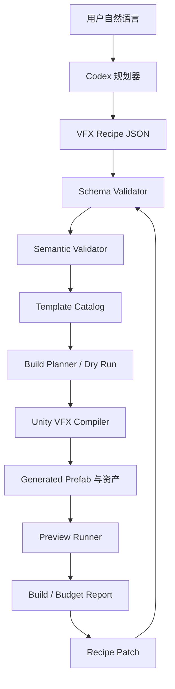

# VFX Composer 技术开发计划

> 文档状态：v1.0 技术基线；S1–S11 已实施并通过内部 MVP 0.1.0 验收  
> 当前范围：Unity 单引擎，先 2D、后 3D  
> 技术基线：**Unity 2022.3.62f3c1 + URP 14.x**（2026-08-22 定版；见 [决策定版](DECISIONS.md)）  
> 首个验证案例：卡通火球（Launch → Travel → Impact）  
> 关联文档：[设计路线](DESIGN_PLAN.md) · [项目计划](PROJECT_PLAN.md)

## 1. 文档目的

本计划说明 VFX Composer 第一阶段应如何设计、实现、验证和交付。

项目不是从零训练文生特效模型，也不是让 AI 直接写入 Unity 序列化资产，而是建立一条可控的特效生产链：

```text
自然语言需求
→ Codex 规划
→ VFX Recipe
→ Schema 与项目规则验证
→ 检索本地模板
→ Unity 编译器组装原生资产
→ 固定场景预览与检查
→ 局部 Patch
→ 确定性重新构建
```

本计划优先验证工程闭环、可重复性和可编辑性，不以第一版的画面质量作为唯一成功标准。

## 2. 项目目标

### 2.1 核心目标

1. 将技能特效表示为结构化、可版本化、可验证的 Recipe。
2. 使用经过登记的 Unity 模板生成普通 Prefab、材质实例和粒子系统。
3. 支持 Launch、Travel、Impact 等阶段独立播放和组合播放。
4. 支持自然语言产生 Recipe，但所有结果必须经过确定性验证。
5. 支持“火星减少一半”等局部修改，不必重新规划整个特效。
6. 先完成 2D 特效，再证明同一阶段语义能够扩展到 3D。
7. 生成资产在游戏运行时不依赖 Codex，也不依赖 Editor 程序集。

### 2.2 非目标

第一阶段明确不包含：

- Cocos、Unreal 或其他引擎适配。
- 任意生成 Unity VFX Graph 节点图。
- 云端生成图片、Flipbook、Mesh、骨骼或动画。
- AI 自动决定伤害、碰撞、追踪和网络同步逻辑。
- 运行时调用 AI。
- 自动视觉评分与自动无限迭代。
- 一句话生成任意类型、任意风格的生产级特效。
- 完整节点编辑器或替代 Unity Inspector 的通用编辑器。

## 3. 基线与前提

### 3.1 技术基线

- Unity：Unity 2022.3.62f3c1，项目与自动化脚本锁定此精确版本。
- 渲染管线：Universal Render Pipeline 14.x。
- 语言：C#。
- 资产生产：Unity Editor API。
- 第一版粒子：Built-in Particle System。
- 常用表现组件：SpriteRenderer、ParticleSystem、TrailRenderer、MeshRenderer、Animator。
- 包结构：Unity Package Manager 自定义包。
- 测试：Unity Test Framework，EditMode 为主，必要时增加 PlayMode。
- Recipe：UTF-8 JSON，使用 JSON Schema 与 C# 语义验证双重检查。
- JSON 序列化：优先使用 Unity 官方维护的 Newtonsoft Json 包；不使用 `JsonUtility` 承担完整 Recipe，因为 Recipe 包含字典和版本化结构。
- 版本控制：Git；Unity `.meta` 文件必须提交。

### 3.2 产品假设

- 模板资产由人工制作和审核，AI 只选择模板和填写允许参数。
- `/Templates` 是只读输入，`/Generated` 是工具唯一写入区域。
- JSON Recipe 是生成流程的权威来源。
- 生成 Prefab 允许查看和调试；如果用户直接修改生成物，必须明确其管理状态。
- 性能预算第一版是静态预检，不等同于真机性能认证。

## 4. 总体架构



### 4.1 模块边界

| 模块 | 职责 | 不负责 |
|---|---|---|
| Recipe Model | 描述阶段、模块、参数和预算 | 创建 Unity 对象 |
| Template Catalog | 登记模板、参数契约和成本 | 推断用户需求 |
| Validator | 检查结构、引用、参数、预算 | 静默修复未知错误 |
| Build Planner | 产生拟创建、更新、删除清单 | 修改资产 |
| Unity Compiler | 通过 Unity API 生成资产 | 自由发挥美术设计 |
| Preview Runner | 播放阶段和采集结果 | 判断伤害或命中逻辑 |
| Patch Engine | 对 Recipe 做受控局部修改 | 直接修改生成 Prefab |
| Codex Workflow | 理解文字、选模板、生成 Patch | 绕过验证器写资产 |

## 5. 核心领域模型

### 5.1 Recipe 根对象

建议字段：

```json
{
  "recipeVersion": 1,
  "id": "fireball_2d",
  "name": "Fireball 2D",
  "dimension": "2d",
  "archetype": "projectile",
  "style": "stylized",
  "targetProfile": "mobile_medium",
  "randomSeed": 42,
  "stages": [],
  "metadata": {
    "createdBy": "codex",
    "templateCatalogVersion": "1.0.0"
  }
}
```

必需字段：

- `recipeVersion`
- `id`
- `dimension`
- `archetype`
- `targetProfile`
- `randomSeed`
- `stages`

### 5.2 Stage

第一版支持：

- `launch`
- `travel`
- `impact`
- `end`

Stage 字段：

- `id`
- `trigger`
- `duration`
- `modules`
- `enabled`

第一版不实现复杂条件表达式。Trigger 使用枚举：

- `manual`
- `after_previous`
- `on_launch`
- `on_hit`
- `on_end`

### 5.3 Module

第一版语义模块：

- `energy_body`
- `sprite_emitter`
- `secondary_particles`
- `motion_trail`
- `impact_flash`
- `impact_burst`
- `shockwave`
- `sub_effect`

Module 通用字段：

- `id`：Recipe 内稳定且唯一。
- `kind`：语义类型。
- `templateId`：模板目录中的稳定 ID。
- `parameters`：仅允许模板 Manifest 声明的参数。
- `attachTo`：模板约定挂点。
- `enabled`：允许 Patch 禁用而不删除结构。

模块生产遵循“最大合理拆解”：可复用、可旋转/镜像/平铺、含重复结构或可由 Mesh/Shader/粒子参数重建的完整资源，应拆分为最小稳定语义模块后组合。拆解不得通过复制 Material、GameObject 或纹理实现，也不得以明显增加 Draw Call、Overdraw、接缝和维护成本为代价。

### 5.4 Budget

第一版支持：

- 最大 ParticleSystem 数量。
- 最大估算峰值粒子数。
- 最大材质数量。
- 最大纹理尺寸。
- 是否允许动态灯光。
- 是否允许 Distortion。
- 最大总时长。
- 最大 Trail 数量。
- 可选择的资源导出 Profile、Texture Scale、Max Atlas Size、平台压缩格式、Build Disk Bytes 上限和 GPU Resident Bytes 上限。

资源导出尺寸不得与游戏世界中的视觉尺寸混用。视觉尺寸由模块/Prefab 参数控制；导出 Profile 只控制纹理分辨率、压缩与资源成本。

预算结果分为：

- `error`：禁止构建。
- `warning`：允许构建但必须显示。
- `info`：优化提示。

## 6. Template Manifest

每个模板必须有机器可读 Manifest：

```json
{
  "manifestVersion": 1,
  "templateId": "unity.2d.embers",
  "templateVersion": "1.0.0",
  "kind": "secondary_particles",
  "dimension": "2d",
  "assetGuid": "<unity-asset-guid>",
  "assetPath": "Assets/VFX/Templates/2D/PFT_2D_Embers.prefab",
  "tags": ["fire", "stylized", "mobile"],
  "parameters": {
    "rate": {
      "type": "float",
      "min": 0,
      "max": 100,
      "default": 18,
      "binding": "particle.emission.rate_over_time"
    },
    "lifetime": {
      "type": "float",
      "min": 0.1,
      "max": 2.0,
      "default": 0.55,
      "binding": "particle.main.start_lifetime"
    }
  },
  "cost": {
    "estimatedPeakParticles": 24,
    "materials": 1,
    "transparentRenderers": 1
  }
}
```

### 6.1 Manifest 规则

1. `templateId` 永不依赖文件名。
2. `templateVersion` 变化必须可检测。
3. `assetGuid` 是稳定引用，`assetPath` 用于可读性与白名单校验；两者不一致时拒绝构建。
4. 参数必须声明类型、默认值和范围。
5. Binding 是编译器登记的符号键，必须映射到白名单 Handler；禁止把它作为反射属性路径执行。
6. 模板必须声明 2D 或 3D，第一版不允许模糊兼容。
7. 模板引用的材质、纹理、Shader 必须能通过依赖扫描找到。

## 7. 生成资产所有权

生成资产分为两种状态：

### 7.1 Managed

- 由 Recipe 管理。
- 可以重新构建。
- Inspector 中直接修改可能被覆盖。
- 生成资产记录 Recipe ID、revision 和 build hash。

### 7.2 Detached

- 用户主动执行“Detach/Bake”。
- 可以自由手工修改。
- 不再参与自动重建。
- 原 Recipe 保留，但构建器不会覆盖 Detached 资产。

MVP 至少实现 Managed；Detach 可以在稳定化阶段加入。

## 8. Unity 包设计

```text
Packages/com.vfxcomposer.unity/
├─ package.json
├─ Runtime/
│  ├─ Components/
│  │  ├─ GeneratedVfxController.cs
│  │  └─ VfxEventReceiver.cs
│  ├─ Model/
│  │  └─ VfxRuntimeStage.cs
│  └─ VFXComposer.Runtime.asmdef
├─ Editor/
│  ├─ Recipe/
│  ├─ Catalog/
│  ├─ Validation/
│  ├─ Build/
│  ├─ Preview/
│  ├─ Reports/
│  ├─ UI/
│  └─ VFXComposer.Editor.asmdef
├─ Tests/
│  ├─ EditMode/
│  └─ PlayMode/
├─ Samples~/
└─ Documentation~/
```

### 8.1 Runtime 程序集

仅包含游戏播放必要组件：

- 阶段播放接口。
- 运行时参数入口。
- Launch/Travel/Impact/End 事件。
- 安全停止和对象池重置支持。

禁止包含：

- Codex 或网络调用。
- UnityEditor 命名空间。
- Recipe 编译器。
- 模板搜索。
- JSON Schema 验证器。

### 8.2 Editor 程序集

包含：

- Recipe 导入与解析。
- 模板目录扫描。
- 验证和 Dry Run。
- Prefab、材质与粒子参数生成。
- 预览窗口。
- 构建报告。
- Managed/Detached 管理。

## 9. Unity 编译器流程

```text
Load Recipe
→ Validate Schema
→ Validate Semantics
→ Resolve Templates
→ Calculate Build Hash
→ Compare Existing Build
→ Produce Dry Run Plan
→ Create Temporary Build
→ Apply Parameters
→ Link Stage Controller
→ Validate Generated Assets
→ Atomically Replace Managed Output
→ Save Build Manifest
```

### 9.1 Dry Run 输出

```json
{
  "recipeId": "fireball_2d",
  "revision": 3,
  "creates": [],
  "updates": [],
  "unchanged": [],
  "blocked": [],
  "warnings": []
}
```

### 9.2 幂等性

当下列输入均相同时，不应修改资产：

- Recipe 规范化内容。
- Recipe revision。
- 随机种子。
- 模板 ID 与版本。
- 模板依赖哈希。
- 编译器版本。
- Unity 版本。

Build Hash 使用规范化 JSON：对象键稳定排序、数值使用稳定格式、数组保持语义顺序，空白和换行不得改变 Hash。

### 9.3 失败处理

- 先在临时生成目录构建。
- 验证通过后再替换 Managed 输出。
- 构建异常时清理临时目录。
- 不删除上一次成功构建。
- 构建报告必须包含错误阶段和资产路径。

## 10. 2D 火球技术设计

### 10.1 模板清单

- `PFT_2D_FireCore`
- `PFT_2D_FireTrail`
- `PFT_2D_Embers`
- `PFT_2D_LaunchFlash`
- `PFT_2D_FireImpact`
- `PFT_2D_Shockwave`

### 10.2 生成 Prefab

```text
VFX_Fireball_2D
├─ RuntimeController
├─ Launch
│  ├─ LaunchFlash
│  └─ LaunchSparks
├─ Travel
│  ├─ CoreSprite
│  ├─ FireTrail
│  └─ Embers
└─ Impact
   ├─ CoreFlash
   ├─ Burst
   └─ Shockwave
```

### 10.3 外部游戏接口

```csharp
void PlayLaunch();
void StartTravel();
void SetTravelTransform(Vector3 position, Quaternion rotation);
void PlayImpact(Vector3 position);
void StopEffect(bool immediate);
```

生成资产不处理：

- 伤害。
- 碰撞。
- 敌我判断。
- 追踪算法。
- 网络复制。

## 11. 3D 扩展设计

3D 阶段在 2D MVP 验收后启动。

增加模块实现：

- Mesh 能量核心。
- Billboard 火焰。
- 3D TrailRenderer。
- Mesh 粒子。
- 3D 冲击环。
- 空间 Bounds。
- 摄像机距离和质量档位。

共享：

- Stage 语义。
- Module ID。
- Patch 机制。
- 模板目录与版本。
- 预算报告格式。
- 外部游戏事件。

不共享：

- Prefab 模板。
- 材质和 Shader。
- 具体参数 Binding。
- 2D Sorting 与 3D Render Queue 规则。

## 12. Codex 接入计划

### 12.1 第一阶段：文件工作流

Codex负责：

1. 读取 Recipe Schema。
2. 读取模板 Manifest。
3. 将用户需求转换为 Recipe。
4. 根据验证报告修复 Recipe。
5. 将增量需求转换为 Patch。

Codex不负责：

- 直接编辑 `.prefab`、`.mat` 或 `.asset`。
- 任意写 C# 并让 Unity 执行。
- 绕过模板范围。
- 在运行时控制游戏。

### 12.2 第二阶段：命令行入口

当 Unity 编译链稳定后，增加 BatchMode 或受控 CLI：

```text
validate-recipe
plan-build
build-recipe
generate-report
```

### 12.3 第三阶段：可选 MCP

只有文件与命令行流程稳定后才考虑：

- `list_vfx_templates`
- `describe_vfx_template`
- `create_vfx_recipe`
- `patch_vfx_recipe`
- `validate_vfx_recipe`
- `build_vfx`
- `preview_vfx`
- `get_vfx_build_report`

MCP 是调用层，不应包含核心业务规则。

## 13. 预览系统

固定预览场景包含：

- 中性背景。
- 统一相机。
- 尺寸参照物。
- 起点与目标点。
- 2D 正交预览模式。
- 3D 透视预览模式（后续）。
- 固定播放速度。
- 重置按钮。

播放模式：

- Launch Only。
- Travel Loop。
- Impact Only。
- Full Sequence。

第一版输出：

- 构建报告。
- 关键阶段截图可作为后续功能。
- 预览视频录制不是 MVP 阻塞项。

## 14. 性能检查

### 14.1 静态检查

- ParticleSystem 数量。
- 估算峰值粒子数。
- 材质数量。
- 透明 Renderer 数量。
- Trail 数量。
- 最大纹理尺寸。
- 总时长。
- 动态灯光。
- Distortion。
- 碰撞模块。
- Sub Emitter 数量。
- Bounds 是否缺失或异常。

### 14.2 运行时检查

稳定化阶段增加：

- 单实例 CPU/GPU 帧耗时。
- 多实例压力场景。
- Draw Call。
- SetPass Call。
- GC Allocation。
- 内存增量。
- 目标设备验证。

静态检查只能称为“预算预检”，不能称为移动端性能通过。

### 14.3 可选择的导出 Profile

在当前 Impact 视觉 MVP 签署后、下一种正式特效进入生产前，实现统一导出规格选择：

1. UI/CLI/未来 MCP 使用同一组 `preview / compact / balanced / high / custom` 语义，不各自发明参数。
2. Recipe Parser、Canonical Hash 和 Validator 接受严格 `export` 对象；旧 Recipe 缺省解析为 `balanced`，保持兼容。
3. Dry Run 在写资产前显示预计 Atlas 尺寸、平台格式、Source/Build/GPU 三栏成本及预算差额。
4. Compiler 按 Profile 确定导出器缩放和 TextureImporter 平台覆盖；实际解析结果进入 Build Hash。
5. Build Manifest 同时保存请求规格和实际结果；不能只保存 Profile 名称。
6. 每个档位使用同一相机和时间线生成视觉 A/B；`compact` 只有在关键帧无明显轮廓、裂纹、Alpha 边缘损坏时才能成为正式候选。
7. 首个实现以 `frost_impact_2d` 做回归样例：保留当前 `balanced`，新增 `compact` 候选，不覆盖用户已签署版本，比较后再决定切换。

该功能属于资源编译与预算能力，不是运行时修改画面大小的功能，也不通过复制多套 Effect Prefab 实现。

### 14.4 最大合理拆解与复用检查

在导出 Profile 机器化时同步实现拆解检查，避免先生成完整大图再仅靠压缩补救：

1. Gate 0 的 Brief 必须为每个视觉角色选择 `whole / segmented / procedural`，并填写复用消费者与预计重复次数。
2. Catalog 为 Segment、Shard、Mote、Mist、Mask、Noise 和基础 Mesh 提供稳定模块 ID；Recipe 只引用模块与组合参数，不复制资源文件。
3. Dry Run 对环形/平铺/重复 Sprite、大面积透明边界和 Effect-local 重复依赖给出拆解建议；能够可靠证明浪费且没有 waiver 时升级为错误。
4. Compiler 优先用一个 Particle System/Renderer 承载多实例模块，禁止“拆成十二段”同时演变成十二个 Material 或十二套纹理。
5. Build Manifest 记录拆解决策、模块消费者、重复次数，以及拆解前后 Source/Build/GPU/Draw Call/Particle 对照。
6. Visual A/B 检查接缝、周期性重复、亮度叠加和轮廓损失；性能收益不能覆盖视觉失败。
7. 首个回归样例为 `frost_impact_2d`：将完整 Broken Ring 候选替换为 `8–16` 个紧凑环段，使用一个 Particle System、一个 Material、`3–4` 个变体与确定性 seed；保留原版本作 A/B，不直接覆盖。

退出条件：拆解版本视觉由用户签署，且至少一个 Source/Build/GPU 指标下降，没有无理由增加 Material/Draw Call，Manifest 能完整追溯组合来源。

### 14.5 经验递归与防复发

从 `frost_impact_2d` 开始，项目采用“具体事故 → 全局经验 → 强制规则 → 机器/人工门禁”的经验提升流程：

1. 每次用户拒绝、视觉事故或资源审计失败，先在 Effect Review 保留原始截图、版本、直接根因、修复和真实证据。
2. 可影响其他 Family、Archetype、Dimension 或渲染后端的结论，必须登记到 `docs/rules/60_ENGINEERING_LESSONS.md`，使用稳定 `EXP-*` 编号。
3. 能机器判断的结论进入 `50_MACHINE_ENFORCEMENT.md` 与测试计划；只能人工判断的结论进入 Gate 5，不允许只写复盘而不改变后续流程。
4. Ring、Aura、Area 边界、循环 Trail、圆形 Mask 和平铺 Noise 实施几何与着色双重闭合；逻辑拆分不得自动变成可见接缝。
5. 编译器生成行为变化必须更新 Compiler Version，或由 Compiler 内容 Hash 自动使 Build 失效；幂等不得掩盖旧输出。
6. 所有压缩、拆解和 Shader 替换都要与上一可审候选同镜头、同时间线 A/B；视觉退化时回滚，资源收益不能使候选通过。
7. 已确认的技术根因必须形成最小防回归测试，例如旧 GUID 不可达、闭环首尾相等、完成帧为空、固定相机和宽高比记录。

`frost_impact_2d` 是首个完整案例：它把不透明方块、能量失衡、大图依赖、过度优化成细线、环形黑缝和 Free Aspect 差异提升为 `EXP-001` 至 `EXP-009`。后续新特效在 Gate 0 必须主动检查经验库，不等待用户再次发现相同问题。

## 15. Patch 设计

第一版使用受限的语义 Patch，不直接采用依赖数组下标的 RFC 6902 路径：

- `replace`
- `add`，仅允许添加已支持模块。
- `remove`，仅允许移除非必需模块。
- `enable`
- `disable`

路径通过稳定的 Stage ID 和 Module ID 定位，例如 `stages/travel/modules/embers`；重新排序模块不会使 Patch 指向其他对象。

示例：

```json
[
  {
    "op": "replace",
    "path": "/stages/travel/modules/embers/parameters/rate",
    "value": 9
  }
]
```

每次 Patch 必须：

1. 校验目标 revision。
2. 校验路径存在。
3. 校验参数范围。
4. 生成新 revision。
5. 计算受影响模块。
6. 产生局部构建计划。
7. 保留变更记录。

## 16. 测试计划

### 16.1 单元测试

- Recipe JSON 解析。
- Schema 版本拒绝。
- 模板 ID 查找。
- 参数类型和范围。
- 路径白名单。
- Budget 计算。
- Build Hash 稳定性。
- Patch 路径解析。
- Patch revision 冲突。

### 16.2 EditMode 集成测试

- 模板 Prefab 加载。
- 生成 Prefab。
- 粒子参数 Binding。
- 材质实例生成。
- 依赖扫描。
- 重复构建幂等。
- 构建失败回滚。
- 模板目录保护。

### 16.3 PlayMode 测试

- Launch/Travel/Impact 独立播放。
- Full Sequence 顺序正确。
- Stop 后粒子和 Trail 正确清理。
- 对象池重用时状态被重置。
- Runtime 程序集不引用 UnityEditor。

### 16.4 金样测试

保留标准 Recipe 与结构快照：

- `fireball-2d.default`
- `fireball-2d.no-embers`
- `fireball-2d.large-impact`
- `fireball-3d.default`，后续加入。

第一版比较结构、参数和依赖，不强制像素级截图比较。

## 17. 可靠性与安全约束

- 禁止文件系统直接修改 Unity YAML 资产。
- 所有 Prefab、材质和 ScriptableObject 修改通过 Unity API。
- 编译器仅可写入配置的 Generated 根目录。
- 模板必须位于 Templates 根目录。
- 禁止动态执行 Recipe 中的代码或类型名。
- 禁止 Recipe 指定任意磁盘路径。
- 所有资源引用使用项目内 GUID 或受验证的 Unity 资产路径。
- 构建前必须验证，构建后必须再次验证。
- 破坏性替换前保留最后一个成功版本或使用临时目录原子替换。

## 18. 分阶段实施

| 阶段 | 主要内容 | 退出条件 |
|---|---|---|
| D0 | Unity 项目、UPM 包、目录与测试基线 | 空包加载、测试可运行 |
| D1 | Recipe、Manifest、Catalog、Validator | 合法样例通过，非法输入被拒绝 |
| D2 | 手工制作 2D 火球模板 | 模板可独立预览且参数契约明确 |
| D3 | Dry Run 与确定性编译器 | Recipe 稳定生成 Prefab，重复构建幂等 |
| D4 | Runtime Controller 与固定预览 | 阶段可独立和完整播放 |
| D5 | Patch 与局部重建 | 火星减半只影响目标模块 |
| D6 | Codex 文件工作流 | 文字可生成合法 Recipe 并根据错误修正 |
| D7 | 3D 火球扩展 | 共享语义成功生成 3D Prefab |
| D8 | 稳定化、文档和发布包 | 验收、测试、样例和使用文档完整 |

## 19. 技术完成定义

一个功能只有同时满足以下条件才算完成：

- 代码已进入正确程序集。
- 有成功路径和失败路径测试。
- 不绕过路径与模板保护。
- 错误返回可定位，不只输出异常堆栈。
- 修改没有引入 Runtime → Editor 反向依赖。
- 文档和示例同步更新。
- 生成资产可以在 PlayMode 播放。
- 构建结果可由 Recipe、模板版本和 build hash 追溯。

## 20. 后续扩展顺序

完成火球 2D/3D 后，按风险从低到高扩展：

1. Impact：纯爆炸与命中反馈。
2. Slash：2D 刀光、3D 弧形 Mesh 与 Trail。
3. Aura：循环环绕与持续状态。
4. Area：区域持续粒子和地面表现。
5. Beam：持续光束与端点。
6. Status：角色挂点与循环特效。
7. 云端纹理和 Flipbook 导入。
8. 视觉评价与自动建议。
9. 其他引擎适配。

## 21. 已定版决策

本节开放项已在 [决策定版](DECISIONS.md) 中关闭：Unity 2022.3.62f3c1 + URP 14.x；PC Editor 预览并保留 `mobile_medium` 静态预算 profile；接受最小 Runtime 依赖；Managed 可手改但重建覆盖；Detach/Bake 为 P2；2D 首版使用模板封装的 TrailRenderer；首版只做编辑器预览，不做自动截图或真机门禁。

## 22. 参考资料

- [Unity 2022.3 Particle System](https://docs.unity3d.com/2022.3/Documentation/Manual/ParticleSystems.html)
- [Unity 2022.3 Package Manager](https://docs.unity3d.com/2022.3/Documentation/Manual/upm-ui.html)
