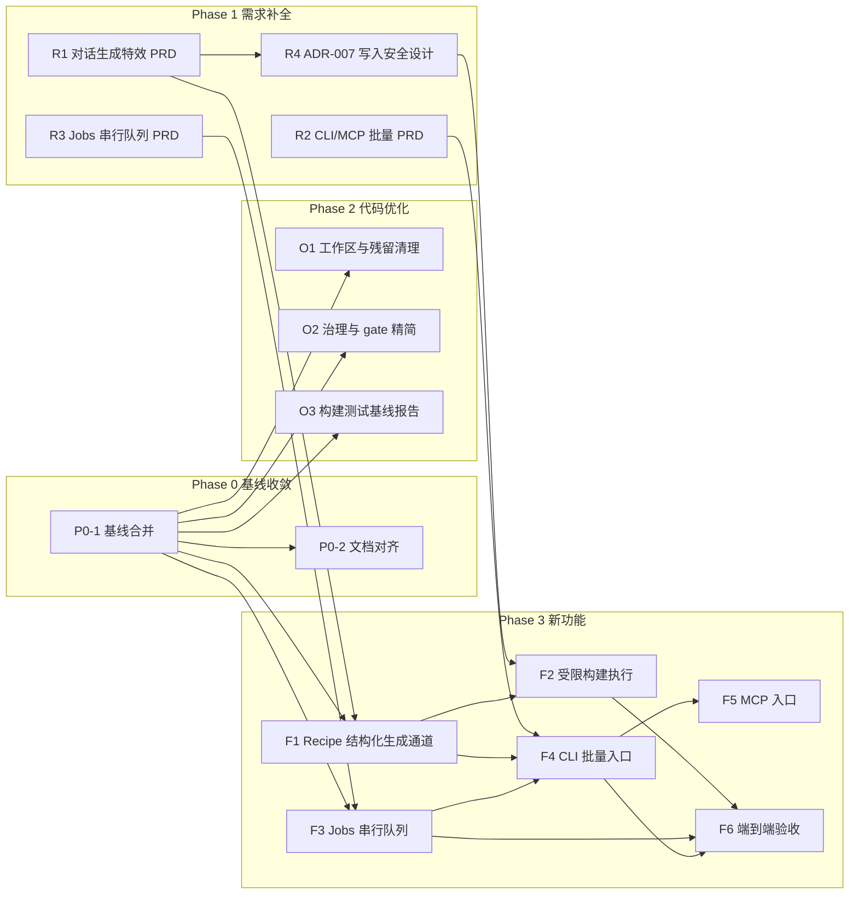

# 开发执行原子计划（主计划）

> 状态：ACTIVE　|　创建：2026-08-29　|　管理者：主 agent（仅派发/调度/验收，不执行开发）
>
> 本计划是当前优化与功能开发的唯一顺序依据。每个原子任务由子 agent 独立完成，允许并行开发与并行验收，但必须遵守各任务卡的文件 allow-list 与依赖关系。

## 1. 背景与目标

仓库现状（2026-08-29 核实）：

- `master` 仅有 phase2 baseline 提交；U0–U6（普通用户 Broker/Worker 只读链路）与 A0–A6（AI 双通道）的全部实现在 `codex/usermode-integration` 分支及 `D:\wt\` 下的 worktree 中，未合并回 master。
- 产品目标功能三大缺口：①对话生成单个特效的端到端链路（AI 输出 → Recipe → 校验 → 构建 Prefab）；②MCP/CLI 批量生成入口；③受机器配置限制的串行 Jobs 队列。
- 特效编译核心（`VfxCompiler`、`Impact2DCompiler`、`Area2DCompiler`、`S12SlashCompiler` 等）已在 Unity 包 `project/Packages/com.vfxcomposer.unity` 内实现并有测试，产物写入根为 `Assets/VFX/Generated`（另有共享资产目录 `Assets/VFX/Shared`，写入政策由 ADR-007 裁决）。

总目标按顺序分三段：**需求内容补全 → 代码优化 → 新功能开发**。

## 2. 治理模型

| 角色 | 职责 |
|---|---|
| 主 agent | 制定/维护本计划；派发任务；调度并行；验收（可派发独立审计子 agent 并行验收）；合并分支；更新任务状态。 |
| 开发子 agent | 按任务卡完成开发，只允许改动 allow-list 内文件；完成后提交报告（改动清单、测试结果、自检结论）。 |
| 审计子 agent | 只读验收：核对 allow-list、跑构建/测试、对照验收标准，输出 PASS/FAIL 与问题清单。 |

执行规则：

1. **原子性**：每个任务卡一次派发、一次交付；发现问题允许一次返工回合，返工仍不过则任务标记 FAIL 并由主 agent 重新拆解。
2. **并行安全**：可并行的任务其 allow-list 不得相交；涉及大范围代码改动的任务在独立 git worktree/分支（`task/<id>-<slug>`，worktree 置于 `D:\wt\`）中进行；纯新增文档任务可直接在主工作区新增文件（禁止改已有文件）。
3. **提交纪律**：开发子 agent 不得直接提交到 master；合并由主 agent 在验收 PASS 后执行。
4. **验收基线**：Release 构建 0 warning/0 error（仓库已开 `TreatWarningsAsErrors`）、锁定 restore、相关测试全绿、符合 `docs/plans/CODING_STANDARDS.md`。
5. 本计划与旧治理文档（receipt/独立审计/gate 全套）冲突时，以本计划为准：保留 `eng/run-phase2-gate.ps1` 作为里程碑级质量闸，日常任务验收用第 4 条基线，不再要求 receipt 官僚层。

## 3. 阶段 DAG 与并行泳道

并行泳道：P0-1 与 R1/R2/R3 可同时开工（R 系列只新增文档）；O1/O2/O3 相互并行；F1 与 F3 相互并行；F2 与 F4 在 F1 完成后并行。

## 4. 原子任务卡

### Phase 0 基线收敛

**P0-1 基线合并**
- 目标：将 `codex/usermode-integration` 合并进 `master`，使 U/A 两条线的实现成为主线事实。
- 依赖：无。
- 交付物：master 上的 merge 提交；Release 构建与全量测试结果报告。
- allow-list：git 合并涉及的全部 tracked 文件（不新增功能代码）；根目录未跟踪的 `PROJECT_ARCHITECTURE_AND_DEVELOPMENT.md` 与分支同名提交冲突时，以分支版本为准。
- 验收标准：merge 完成无冲突残留；`dotnet build VFXComposer.sln -c Release` 0 warning/0 error；`dotnet test` 全绿（记录各项目通过数）。

**P0-2 文档对齐**（依赖 P0-1）
- 目标：消除 `docs/coordination/`（仍写 P1 active、Phase 2 NO-GO）与架构文档、实际代码之间的矛盾；标注 superseded 段落。
- 交付物：更新后的 coordination 三份文档 + 顶部状态摘要。
- allow-list：`docs/coordination/**`、`PROJECT_ARCHITECTURE_AND_DEVELOPMENT.md`（仅追加"当前计划入口"指向本文件）。
- 验收标准：三份文档当前状态段一致指向本计划；无残留"active P1"类误导表述。

### Phase 1 需求补全

**R1 对话生成特效 PRD**
- 目标：定义"文字对话 → 单个特效"的完整产品需求：用户流程、输入输出、与现有能力（Chat 通道、Recipe schema、`RecipeValidator`、Unity 编译器）的映射、缺口清单、验收场景。
- 依赖：无（并行于 P0-1；代码参考读 `D:\wt\i2s-integration`）。
- 交付物：`docs/requirements/REQ-001_CHAT_TO_VFX.md`。
- allow-list：仅新增该文件。
- 验收标准：覆盖正常流/失败流/非目标；每条需求可测试；缺口与 F1/F2 任务能一一对应。

**R2 CLI/MCP 批量生成 PRD**
- 目标：定义批量需求入口：需求清单格式、CLI 命令面、MCP 工具面、与 Jobs 队列的关系、安全边界（不绕过校验与写入限制）。
- 依赖：无。
- 交付物：`docs/requirements/REQ-002_BATCH_CLI_MCP.md`。
- allow-list：仅新增该文件。
- 验收标准：CLI 与 MCP 共用同一执行层；批量语义（顺序、失败继续/中止、幂等）明确。

**R3 Jobs 串行队列 PRD**
- 目标：定义受机器配置限制的单并发任务队列：任务生命周期、持久化、进度/取消、Unity 单实例锁的调度约束、Desktop Jobs 页展示需求。
- 依赖：无。
- 交付物：`docs/requirements/REQ-003_JOBS_QUEUE.md`。
- allow-list：仅新增该文件。
- 验收标准：与 Protocol 现有 Job DTO（`JobProgress`、`CancelJobCommand` 等）兼容；崩溃恢复语义明确。

**R4 ADR-007 项目写入安全设计**（依赖 R1）
- 目标：为"AI 产物写入 Unity 项目"建立新 ADR：路径 containment（限 `Assets/VFX/Generated`，`Assets/VFX/Shared` 政策一并裁决）、原子写入/回滚、覆盖策略、威胁模型增量、fail-closed 行为。
- 交付物：`docs/rules/ADR-007_CONTROLLED_PROJECT_MUTATION.md`。
- allow-list：仅新增该文件。
- 验收标准：不推翻 ADR-005/006 既有边界；每个写入路径有明确的拒绝条件。

### Phase 2 代码优化（均依赖 P0-1）

**O1 工作区与残留清理**
- 目标：清理 master 上分支切换残留（空目录等）、确认 `.gitignore` 覆盖 `.codex_tmp` 等产物目录、盘点 `D:\wt\` 各 worktree 哪些可退役。
- 交付物：清理提交 + worktree 退役建议清单（文档）。
- 验收标准：`git status` 干净；构建不受影响。

**O2 治理与 gate 精简**
- 目标：保留 `eng/run-phase2-gate.ps1` 质量闸能力，产出一个日常可用的轻量验收脚本（构建+测试+schema 校验），并写明何时用重闸、何时用轻闸。
- 交付物：`eng/run-task-acceptance.ps1` + 使用说明。
- 验收标准：轻闸在干净 master 上一次跑通；不修改重闸行为。

**O3 构建与测试基线报告**
- 目标：在合并后的 master 上完整跑一遍构建、全量 .NET 测试、Unity EditMode 测试（如可行），形成新基线数字，供后续任务对照。
- 交付物：`docs/plans/BASELINE_REPORT.md`。
- 验收标准：数字可复现（附命令）；失败项如实记录并分类（阻塞/非阻塞）。

### Phase 3 新功能

**F1 Recipe 结构化生成通道**（依赖 P0-1、R1）
- 目标：在 Chat 通道之上实现面向特效的结构化生成：Recipe schema 约束的 prompt 模板、AI 输出解析、schema 校验、失败重试话术；产物为 recipe JSON 草稿（不写 Unity 项目）。
- 建议位置：`src/VFXComposer.AI.Providers` 新子域 + Desktop Create 页接线。
- 验收标准：给定固定 mock AI 响应，解析/校验/错误路径测试全绿；不产生自动网络请求。

**F2 受限构建执行**（依赖 F1、R4）
- 目标：把 recipe 草稿交给 Unity 侧编译器构建 Prefab。执行体按 ADR-007 裁决：用户显式触发的 Unity batchmode 短生命进程（扩展 `Invoke-Unity.ps1` 纪律），不复用只读链路、不给 Worker 加写权限；写入面为封闭清单 `Assets/VFX/Generated/**` + `ProjectSettings/VFXComposer/BuildManifests/*.manifest.json`，`Assets/VFX/Shared` 构建期只读。
- 范围（ADR-007 裁决）：首版限 v1 `VfxCompiler` 模板域；`Impact2DCompiler`/`Area2DCompiler` 因无条件 `Ensure()` 覆盖 Shared，在提供只验证模式前不进 AI 构建范围。
- 开工前置决策（来自 R4）：生产闸走 `BuildProduction`（含 `W24S5ProductionGateRequest`）还是新增等价受限入口；由主 agent 在派发时定版。
- 验收标准：一个样例 recipe 端到端产出 Prefab；越界路径写入被拒绝且有测试（含 Windows 保留名等负向用例）。

**F3 Jobs 串行队列**（依赖 P0-1、R3）
- 目标：实现单并发持久化任务队列 + Desktop Jobs 页（列表/进度/取消），复用 Protocol Job DTO。
- 开工首个设计决策（来自 R3 调研）：队列执行器宿主形态（内嵌 Desktop vs 独立宿主进程），直接影响 CLI `--detach` 与无 Desktop 场景的 MCP 提交；开工前由主 agent 定版。
- 验收标准：入队/执行/取消/崩溃恢复测试全绿；并发提交时严格串行执行。

**F4 CLI 批量入口**（依赖 F1、F3、R2）
- 目标：独立 CLI（新 console 工程），读取需求清单文件，逐条入队生成，输出进度与结果汇总。
- 验收标准：样例清单批量跑通；单条失败不中断整批（按 R2 语义）。

**F5 MCP 入口**（依赖 F4）
- 目标：MCP server 暴露"生成特效/查询任务"工具，复用 F4 执行层；仅 stdio transport，不引入新网络面。
- 开工前置决策（来自 R2 调研）：官方 MCP C# SDK 不在本地批准 feed 内，需先做 feed 准入决策，或选择手写 stdio JSON-RPC；由主 agent 定版。
- 验收标准：MCP 客户端可发起生成并查询任务状态。

**F6 端到端验收**（依赖 F2、F3、F4）
- 目标：对话生成单个特效 + CLI 批量生成多个特效两条主流程的 E2E 测试与人工验收脚本。
- 验收标准：两条主流程在干净环境一次跑通并有记录。

## 5. 任务状态板

| 任务 | 状态 | 派发对象 | 验收 |
|---|---|---|---|
| P0-1 | DONE | 开发子 agent | 初审 PASS（merge `3375a8fe`，构建 0/0，测试 450/450）；O3 复跑作独立复核 |
| P0-2 | DONE | 开发子 agent | 主 agent 验收 PASS（5 文件纯追加标注，历史数字零改动）；范围外遗留（stage-notes/ADR-004/ai-workflow README 指针）追加为 P0-2b |
| R1 | DONE | 开发子 agent | 独立审计 PASS（映射 19 项属实、无阻塞问题）；3 条建议已微调完毕（v0.2），REQ-001 已合入 |
| R2 | DONE | 开发子 agent | 独立审计 PASS；4 条建议已微调（v0.2），REQ-002 已合入 |
| R3 | DONE | 开发子 agent | 独立审计 PASS；同轮微调（v0.2），REQ-003 已合入 |
| R4 | DONE | 开发子 agent | 独立审计 PASS；6 条建议已落实（v1.1），ADR-007 转 ACCEPTED 合入。Phase 1 需求补全全部关闭 |
| O1 | DONE | 开发子 agent | 主 agent 验收 PASS（.gitignore 补齐、空目录清理、退役清单交付；worktree/分支退役延后到 O2/O3 合并后执行，`codex/m1`、`codex/m2` 两个未并入分支暂保留） |
| O2 | DONE | 开发子 agent | 主 agent 验收 PASS（脚本三条路径实测；`-SkipLockedRestore` 为 O3 修复前过渡开关，O3 合并后停用） |
| O3 | DELIVERED | 开发子 agent | 已交付待验收（暂停中，交付在分支 `task/O3-baseline`）：锁修复+锁定 restore 通过、450/450 复核一致；新发现 Unity 包 8 个既有测试失败，F2 前需 triage（拟新增任务 O4） |
| F1 | DISPATCHED | 开发子 agent | 独立 worktree 开发中 |
| F2–F6 | BLOCKED | — | — |

已知非阻塞遗留（P0-1 交付报告）：①`services/VFXComposer.Broker.HandleProbe` 与 `services/VFXComposer.Broker.Tests` 的 `packages.lock.json` 自 baseline 起与引用图不同步（归入 O3）；②`.gitignore` 未覆盖 `tests/**` 构建产物（归入 O1）。

> 状态板由主 agent 在每次派发/验收后更新。
