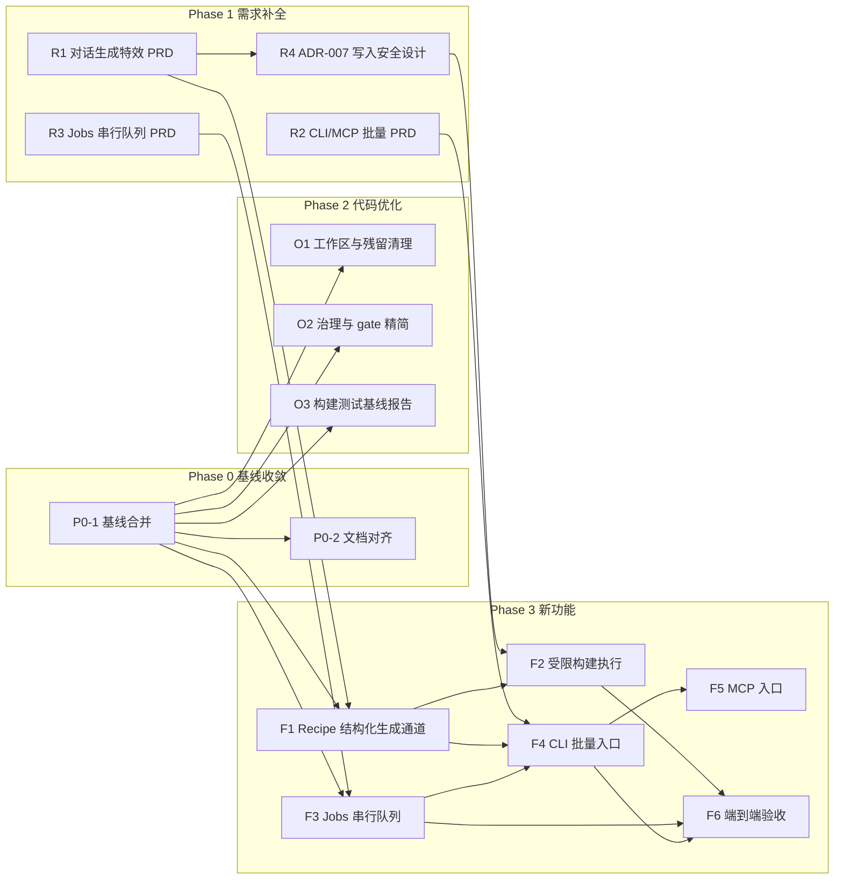

# 开发执行原子计划（主计划）

> 状态：ACTIVE　|　创建：2026-08-29　|　管理者：主 agent（仅派发/调度/验收，不执行开发）
>
> 本计划是当前优化与功能开发的唯一顺序依据。每个原子任务由子 agent 独立完成，允许并行开发与并行验收，但必须遵守各任务卡的文件 allow-list 与依赖关系。

## 1. 背景与目标

仓库现状（2026-08-29 核实）：

- `master` 仅有 phase2 baseline 提交；U0–U6（普通用户 Broker/Worker 只读链路）与 A0–A6（AI 双通道）的全部实现在 `codex/usermode-integration` 分支及 `D:\wt\` 下的 worktree 中，未合并回 master。
- 产品目标功能三大缺口：①对话生成单个特效的端到端链路（AI 输出 → Recipe → 校验 → 构建 Prefab）；②MCP/CLI 批量生成入口；③受机器配置限制的串行 Jobs 队列。
- 特效编译核心（`VfxCompiler`、`Impact2DCompiler`、`Area2DCompiler`、`S12SlashCompiler` 等）已在 Unity 包 `project/Packages/com.vfxcomposer.unity` 内实现并有测试，产物写入根为 `Assets/VFX/Generated`（另有共享资产目录 `Assets/VFX/Shared`，写入政策由 ADR-007 裁决）。

总目标按顺序分三段：**需求内容补全 → 代码优化 → 新功能开发**。

## 2. 治理模型

| 角色 | 职责 |
|---|---|
| 主 agent | 制定/维护本计划；派发任务；调度并行；验收（可派发独立审计子 agent 并行验收）；合并分支；更新任务状态。 |
| 开发子 agent | 按任务卡完成开发，只允许改动 allow-list 内文件；完成后提交报告（改动清单、测试结果、自检结论）。 |
| 审计子 agent | 只读验收：核对 allow-list、跑构建/测试、对照验收标准，输出 PASS/FAIL 与问题清单。 |

执行规则：

1. **原子性**：每个任务卡一次派发、一次交付；发现问题允许一次返工回合，返工仍不过则任务标记 FAIL 并由主 agent 重新拆解。
2. **并行安全**：可并行的任务其 allow-list 不得相交；涉及大范围代码改动的任务在独立 git worktree/分支（`task/<id>-<slug>`，worktree 置于 `D:\wt\`）中进行；纯新增文档任务可直接在主工作区新增文件（禁止改已有文件）。
3. **提交纪律**：开发子 agent 不得直接提交到 master；合并由主 agent 在验收 PASS 后执行。
4. **验收基线**：Release 构建 0 warning/0 error（仓库已开 `TreatWarningsAsErrors`）、锁定 restore、相关测试全绿、符合 `docs/plans/CODING_STANDARDS.md`。
5. 本计划与旧治理文档（receipt/独立审计/gate 全套）冲突时，以本计划为准：保留 `eng/run-phase2-gate.ps1` 作为里程碑级质量闸，日常任务验收用第 4 条基线，不再要求 receipt 官僚层。
6. **子 agent 模型策略**（用户定版，2026-08-29）：后续派发的子 agent 一律使用 **Claude Opus 5 Thinking (High)**；仅限 Claude 系模型，禁止其他厂商模型。轻量文档修订不再单独派发子 agent，由主 agent 直接完成。已在途任务（F3、O4、F1 审计）维持原模型不变。

## 3. 阶段 DAG 与并行泳道

并行泳道：P0-1 与 R1/R2/R3 可同时开工（R 系列只新增文档）；O1/O2/O3 相互并行；F1 与 F3 相互并行；F2 与 F4 在 F1 完成后并行。

## 4. 原子任务卡

### Phase 0 基线收敛

**P0-1 基线合并**
- 目标：将 `codex/usermode-integration` 合并进 `master`，使 U/A 两条线的实现成为主线事实。
- 依赖：无。
- 交付物：master 上的 merge 提交；Release 构建与全量测试结果报告。
- allow-list：git 合并涉及的全部 tracked 文件（不新增功能代码）；根目录未跟踪的 `PROJECT_ARCHITECTURE_AND_DEVELOPMENT.md` 与分支同名提交冲突时，以分支版本为准。
- 验收标准：merge 完成无冲突残留；`dotnet build VFXComposer.sln -c Release` 0 warning/0 error；`dotnet test` 全绿（记录各项目通过数）。

**P0-2 文档对齐**（依赖 P0-1）
- 目标：消除 `docs/coordination/`（仍写 P1 active、Phase 2 NO-GO）与架构文档、实际代码之间的矛盾；标注 superseded 段落。
- 交付物：更新后的 coordination 三份文档 + 顶部状态摘要。
- allow-list：`docs/coordination/**`、`PROJECT_ARCHITECTURE_AND_DEVELOPMENT.md`（仅追加"当前计划入口"指向本文件）。
- 验收标准：三份文档当前状态段一致指向本计划；无残留"active P1"类误导表述。

### Phase 1 需求补全

**R1 对话生成特效 PRD**
- 目标：定义"文字对话 → 单个特效"的完整产品需求：用户流程、输入输出、与现有能力（Chat 通道、Recipe schema、`RecipeValidator`、Unity 编译器）的映射、缺口清单、验收场景。
- 依赖：无（并行于 P0-1；代码参考读 `D:\wt\i2s-integration`）。
- 交付物：`docs/requirements/REQ-001_CHAT_TO_VFX.md`。
- allow-list：仅新增该文件。
- 验收标准：覆盖正常流/失败流/非目标；每条需求可测试；缺口与 F1/F2 任务能一一对应。

**R2 CLI/MCP 批量生成 PRD**
- 目标：定义批量需求入口：需求清单格式、CLI 命令面、MCP 工具面、与 Jobs 队列的关系、安全边界（不绕过校验与写入限制）。
- 依赖：无。
- 交付物：`docs/requirements/REQ-002_BATCH_CLI_MCP.md`。
- allow-list：仅新增该文件。
- 验收标准：CLI 与 MCP 共用同一执行层；批量语义（顺序、失败继续/中止、幂等）明确。

**R3 Jobs 串行队列 PRD**
- 目标：定义受机器配置限制的单并发任务队列：任务生命周期、持久化、进度/取消、Unity 单实例锁的调度约束、Desktop Jobs 页展示需求。
- 依赖：无。
- 交付物：`docs/requirements/REQ-003_JOBS_QUEUE.md`。
- allow-list：仅新增该文件。
- 验收标准：与 Protocol 现有 Job DTO（`JobProgress`、`CancelJobCommand` 等）兼容；崩溃恢复语义明确。

**R4 ADR-007 项目写入安全设计**（依赖 R1）
- 目标：为"AI 产物写入 Unity 项目"建立新 ADR：路径 containment（限 `Assets/VFX/Generated`，`Assets/VFX/Shared` 政策一并裁决）、原子写入/回滚、覆盖策略、威胁模型增量、fail-closed 行为。
- 交付物：`docs/rules/ADR-007_CONTROLLED_PROJECT_MUTATION.md`。
- allow-list：仅新增该文件。
- 验收标准：不推翻 ADR-005/006 既有边界；每个写入路径有明确的拒绝条件。

### Phase 2 代码优化（均依赖 P0-1）

**O1 工作区与残留清理**
- 目标：清理 master 上分支切换残留（空目录等）、确认 `.gitignore` 覆盖 `.codex_tmp` 等产物目录、盘点 `D:\wt\` 各 worktree 哪些可退役。
- 交付物：清理提交 + worktree 退役建议清单（文档）。
- 验收标准：`git status` 干净；构建不受影响。

**O2 治理与 gate 精简**
- 目标：保留 `eng/run-phase2-gate.ps1` 质量闸能力，产出一个日常可用的轻量验收脚本（构建+测试+schema 校验），并写明何时用重闸、何时用轻闸。
- 交付物：`eng/run-task-acceptance.ps1` + 使用说明。
- 验收标准：轻闸在干净 master 上一次跑通；不修改重闸行为。

**O3 构建与测试基线报告**
- 目标：在合并后的 master 上完整跑一遍构建、全量 .NET 测试、Unity EditMode 测试（如可行），形成新基线数字，供后续任务对照。
- 交付物：`docs/plans/BASELINE_REPORT.md`。
- 验收标准：数字可复现（附命令）；失败项如实记录并分类（阻塞/非阻塞）。

**O4 Unity 既有测试失败 triage**（依赖 O3；F2 的前置）
- 目标：对 O3 发现的 Unity EditMode 8 个确定性既有失败逐个定位根因并处置：属"陈旧 pin/fixture/注册表与现状不同步"的直接修复；属真实缺陷或需产品决策的，出报告待主 agent 裁决。八项症状：契约 sha256 pin 不符 ×2、错误码清单不同步、preview 场景缺 driver 组件 ×2、W24FS107≠W24FS109、句柄暴露检查、状态注册断言。
- allow-list：`project/Packages/com.vfxcomposer.unity/**` 中与八项失败直接相关的测试/fixture/契约 pin/注册表文件；`docs/plans/UNITY_TEST_TRIAGE.md`（新建报告）。
- 验收标准：EditMode 全绿，或"修复 N 项 + 明确豁免清单（每项有根因与裁决请求）"；.NET 侧零改动。

### Phase 3 新功能

**F1 Recipe 结构化生成通道**（依赖 P0-1、R1）
- 目标：在 Chat 通道之上实现面向特效的结构化生成：Recipe schema 约束的 prompt 模板、AI 输出解析、schema 校验、失败重试话术；产物为 recipe JSON 草稿（不写 Unity 项目）。
- 建议位置：`src/VFXComposer.AI.Providers` 新子域 + Desktop Create 页接线。
- 验收标准：给定固定 mock AI 响应，解析/校验/错误路径测试全绿；不产生自动网络请求。

**F2 受限构建执行**（依赖 F1、R4）
- 目标：把 recipe 草稿交给 Unity 侧编译器构建 Prefab。执行体按 ADR-007 裁决：用户显式触发的 Unity batchmode 短生命进程（扩展 `Invoke-Unity.ps1` 纪律），不复用只读链路、不给 Worker 加写权限；写入面为封闭清单 `Assets/VFX/Generated/**` + `ProjectSettings/VFXComposer/BuildManifests/*.manifest.json`，`Assets/VFX/Shared` 构建期只读。
- 范围（ADR-007 裁决）：首版限 v1 `VfxCompiler` 模板域；`Impact2DCompiler`/`Area2DCompiler` 因无条件 `Ensure()` 覆盖 Shared，在提供只验证模式前不进 AI 构建范围。
- ~~生产闸初版决策（复用 `BuildProduction`）~~ **已被 F2 停手报告推翻并重新定版（主 agent，2026-08-29，ADR-007 v1.2）**：F2 核实 `BuildProduction` 对 AI recipe 无可达成功路径（formal 分支要求 docs/ 契约与 trace，legacy 分支被 `CommitFormalManifest` 拒绝 E24S5-092 成死路，全仓零成功调用点）；且 strict E8014 要求 recipe 已在 `Assets/VFX/Recipes/**` 溯源，与项目外暂存矛盾。裁决采纳候选方案 A：①ADR-007 写入面增补成员 3（`Assets/VFX/Recipes/<Sanitize(effectId)>.json` 构建溯源单文件，仅构建入口哈希复验后原子写入）；②构建走 legacy `Build` + 执行器层计划绑定提交（DryRun 计划 → 提交前复核 recipeHash/revision/buildHash/输出路径，等价 `MatchesExactPlan` 语义），不走 `W24S5ProductionGate`；③legacy 批准死路记录为 W24 既有缺陷，保持 fail-closed 不修。附带定版：Unity 侧无 catalog 版本号（`templateCatalogVersion` 为自由文本），F2 的 catalog 比对降级为**记录性**字段（构建结果记录 recipe 声称的 catalog 版本文本 + 派生身份哈希如模板 id/version/assetGuid），硬性门槛保持"逐模板存在性 + L2 权威校验"（模板漂移必然在此失败）。
- 清单可移植性已定版（主 agent，2026-08-29，v1；措辞按 F2 审计建议 2 修正）：**还原纪律方案**——构建/测试轮次后 `project/` 的**一切漂移**（`dependencyHash`、`buildHash`、manifest 新字段、时间戳、Runtime 序列化连锁的 prefab 重写、未跟踪残留）一律 `git checkout -- project; git clean -fd project` 还原不入提交；"生成区零 diff"断言不能只排除 `dependencyHash` 字段，应改用未跟踪条目计数或还原后比对。把 `dependencyHash` 移出入库清单的 schema 改造记为后续债务（F6 后评估）。
- 验收标准：一个样例 recipe 端到端产出 Prefab；越界路径写入被拒绝且有测试（含 Windows 保留名等负向用例）。

**F3 Jobs 串行队列**（依赖 P0-1、R3）
- 目标：实现单并发持久化任务队列 + Desktop Jobs 页（列表/进度/取消），复用 Protocol Job DTO。
- 宿主形态已定版（主 agent，2026-08-29）：执行层做成**库**（新程序集 `src/VFXComposer.Jobs`，仅依赖 Protocol）+ 跨进程 durable 单写者锁（复用 `ProviderConfigurationRevisionLock` 模式）；Desktop/CLI/MCP 各入口在进程内宿主执行器，锁保证全局并发=1；不引入常驻服务与新网络面。CLI `--detach` 语义由 F4 在此模型上实现（提交进程退出后队列状态在 store 中，接续执行由下一个宿主进程恢复）。
- 验收标准：入队/执行/取消/崩溃恢复测试全绿；并发提交时严格串行执行。

**F3b Jobs 队列加固**（依赖 F3；F4 的前置。来源：F3 审计非阻塞建议 1/2/4/6/7）
- 目标：① `JobQueueHost` 执行循环补非 `JobQueueException` 兜底（磁盘/权限故障时把当前 job 以稳定码定局后继续循环，不得让队列静默停摆或留下 RUNNING 悬挂 + 锁占用）；② 宿主无注册 executor 时不领取 job（或不取执行器锁），消除 Desktop 零 executor 宿主抢锁把未来 CLI job 判死（VFXJ0006）的前向风险；③ `SystemJobProcessInspector` 补"启动时间不匹配则不终止"的真实子进程测试（REQ-003-08 防 PID 复用路径），并在注释说明 1 秒容差来源；④ 产物数 ≤64 与 payload ≤65536 的越界拒绝负向测试。
- allow-list：`src/VFXComposer.Jobs/**`、`src/VFXComposer.Jobs.Tests/**`、`apps/VFXComposer.Desktop/App.axaml.cs`（仅②需要时）、`apps/VFXComposer.Desktop.Tests/**`（仅②需要时）。
- 验收标准：构建 0/0；全量测试全绿（≥532）；①②各有专项测试。

**F4 CLI 批量入口**（依赖 F1、F3、F3b、R2）
- 目标：独立 CLI（新 console 工程），读取需求清单文件，逐条入队生成，输出进度与结果汇总。
- 验收标准：样例清单批量跑通；单条失败不中断整批（按 R2 语义）。

**F3c Jobs itemId 持久化**（依赖 F3；F6 前置。来源：F4 交付已知限制 1）
- 目标：`JobRecord` 持久化 `itemId`（目前只参与幂等键派生不落库），使 `queue list`/`batch status`/Desktop Jobs 页可按 REQ-003 §9.1 展示 itemId。store schema 变更需显式处理版本（升版或兼容读取，方案自定并说明理由，保持未知版本 fail-closed 纪律）。
- allow-list：`src/VFXComposer.Jobs/**`、`src/VFXComposer.Jobs.Tests/**`、Desktop Jobs 页文件（`JobsViewModel`/`JobListItemViewModel`/`JobsView.axaml*`）、`apps/VFXComposer.Desktop.Tests/**`。CLI 侧展示归 F5，不在本卡。
- 验收标准：构建 0/0；全量测试全绿；itemId 跨崩溃恢复/重新入队保持；版本处理有专项测试。

**F5 MCP 入口**（依赖 F4）
- 目标：MCP server 暴露"生成特效/查询任务"工具，复用 F4 执行层（`VFXComposer.Batch.Core`）；仅 stdio transport，不引入新网络面。
- 底座已定版（主 agent，2026-08-29）：**手写 stdio JSON-RPC**（不引入官方 MCP C# SDK——不在批准 feed，且 REQ-002 §7 工具面是闭集手写量可控）；零新 NuGet。
- 随卡收纳 F4 审计建议：①增补 `batch cancel <batchId>`（执行层方法 + CLI 命令 + MCP 工具 `vfx_cancel_batch`，见 REQ-002 §6.2 勘误）；②`BatchVerdict.Pending` 在退出码映射中显式处理（不落默认 0）；③CLI notice 输出附带 `JobQueueException` 稳定码。
- 验收标准：MCP 客户端可发起生成并查询任务状态（stdio 往返测试，mock 通道）；工具面与 REQ-002 §7 一致（含新增 `vfx_cancel_batch`）；redaction 与零网络测试同 CLI 标准。

**F6 端到端验收**（依赖 F2、F3、F4、F5；任务卡已细化定稿 2026-08-29，待 F2 合入后派发）
- 目标：对话生成单个特效 + CLI 批量生成多个特效两条主流程的 E2E 测试与人工验收脚本；同时清算 F1/F3/F4/F5 审计遗留的全部必做项。
- 必做清算项（来源见各审计处置段）：
  - ① `BatchQueueReportBuilder.EntryLabel` 改 `job.ItemId ?? job.JobId` 并修正失实注释（F5 建议①，决定 MCP `vfx_get_batch_report` 满足 REQ-003 §9.1）。
  - ② CLI/MCP 双面等价性测试改构造性：反射遍历 `JobRecord` 属性 + 显式排除清单（`JobId`/`RequestId`/`IdempotencyKey`/时间戳/`SourceEntry`），当前 `ItemId` 已漏在断言外（F5 建议②）。
  - ③ IL 扫描面（`NoProjectAccessSurfaceTests.ProductAssemblies`）纳入 `vfxc`/`vfxc-mcp` 两个入口装配体（F4 建议⑤ + F5 建议⑤合并）。
  - ④ MCP 侧 `vfx_validate_manifest` 零网络证据补齐（F5 建议⑥）；生产组合根零网络真实用例（F4 建议⑤余项）。
  - ⑤ `batches/` 样例清单 + schema 入库（F4 建议⑧），作为 E2E 批量流程的固定输入。样例 recipe 必须符合 strict 结构预算（F2 已知限制①：至多 2 个渲染模块 stage、无 attachTo 链、三 stage 根齐全）。
  - ⑥ VFXB 精确失败码持久化到队列可见面（F2 审计建议①：如 artifact `failure:VFXB00xx` 或诊断详情字段，使构建失败排障不依赖 Unity 日志）。
- 裁量项（时间允许则做，否则逐条记录不做理由）：F5 建议③（`single-` 保留前缀或注释降级）、④（派生清单 onFailure 断言）、⑦（MCP Ctrl+C 假象）、⑧（initialize 必需成员）、⑨（常量重复）；F4 建议④（ValidationFailed/ChannelFailed 区分码）；F3 建议 3（执行器锁跨进程真杀测试）；F1 建议②（Desktop 裸 catch 稳定码治理）；F2 审计建议③（查明 E2E 空目录 `Assets/VFX/Shared/Materials|Textures` 创建方）、④（`InlineManifestRecipeProbe` 注释过时修正，顺带）、⑤（入口 `WriteResult` 结果路径项目外复验）。
- E2E 范围：流程一（Desktop 对话 → recipe 草稿 → 确认 → 构建 → Prefab 三件套核验）可用 mock 通道 + 真实 Unity batchmode；流程二（CLI 清单批量 → 队列串行 → 报告/退出码核验）+ MCP 冒烟（提交/状态/取消往返）。人工验收脚本写入 `eng/`。
- allow-list：`tests/**`（新 E2E 工程）、`batches/**`（样例清单与 schema）、`eng/**`（验收脚本）、清算项①-④涉及的 `src/VFXComposer.Batch.Core/**`、`apps/VFXComposer.Cli*/**`、`apps/VFXComposer.Mcp*/**`、`src/VFXComposer.*.Tests/**`；禁止改动 Jobs 核心语义与 Unity 包生产代码。
- 验收标准：两条主流程在干净环境一次跑通并有记录；必做清算项①-⑤全部落地有测试；Release 全量测试不回退；EditMode 基线不回退；dependencyHash 还原纪律照旧。

## 5. 任务状态板

| 任务 | 状态 | 派发对象 | 验收 |
|---|---|---|---|
| P0-1 | DONE | 开发子 agent | 初审 PASS（merge `3375a8fe`，构建 0/0，测试 450/450）；O3 复跑作独立复核 |
| P0-2 | DONE | 开发子 agent | 主 agent 验收 PASS（5 文件纯追加标注，历史数字零改动）；范围外遗留（stage-notes/ADR-004/ai-workflow README 指针）追加为 P0-2b |
| R1 | DONE | 开发子 agent | 独立审计 PASS（映射 19 项属实、无阻塞问题）；3 条建议已微调完毕（v0.2），REQ-001 已合入 |
| R2 | DONE | 开发子 agent | 独立审计 PASS；4 条建议已微调（v0.2），REQ-002 已合入 |
| R3 | DONE | 开发子 agent | 独立审计 PASS；同轮微调（v0.2），REQ-003 已合入 |
| R4 | DONE | 开发子 agent | 独立审计 PASS；6 条建议已落实（v1.1），ADR-007 转 ACCEPTED 合入。Phase 1 需求补全全部关闭 |
| O1 | DONE | 开发子 agent | 主 agent 验收 PASS（.gitignore 补齐、空目录清理、退役清单交付；worktree/分支退役延后到 O2/O3 合并后执行，`codex/m1`、`codex/m2` 两个未并入分支暂保留） |
| O2 | DONE | 开发子 agent | 主 agent 验收 PASS（脚本三条路径实测；`-SkipLockedRestore` 为 O3 修复前过渡开关，O3 合并后停用） |
| O3 | DONE | 开发子 agent | 验收 PASS 并合并（`1aba917f`）：锁修复无版本变化、锁定 restore 18/18、450/450 独立复核一致；轻闸 `-SkipLockedRestore` 不再需要 |
| O4 | DONE | 开发子 agent | 返工轮验收 PASS：EditMode **658 = 604/0/54 归零**（54 跳过中恰 1 条为 R-4 显式豁免），合并 `见 git log`。返工轮补充裁决：R-5 双闭集细化批准（W17W18 直接子目录是分包层非 effectId，"下探型/自持清单型"两闭集均为收紧）；R-2 实际重封 7 文件（pin 连锁到 3 契约自哈希与配对 trace，均由生产代码计算并双算核验）；4 篇 stage-notes 的旧哈希叙述记录属历史文档，不清理。**Phase 2 全部关闭，F2 解锁**。历史备注：**双交付事件**：被判卡死而重派的首实例实际在长跑 Unity 测试，21:17 也交付了（分支 `task/O4-unity-test-triage`，6 修 2 裁决，EditMode 602/2/53）；主 agent 择定 O4b 路线（首实例对 sustained flame pin 做了级联 re-pin，与既定 R-4 豁免裁决相悖；两实例独立得出相同 preview 根因，互为佐证）。首实例分支暂留参考，O4b 合入后退役。O4b 首轮交付：2 项已修（错误码清单补登 14 码、W24FS107 断言修正且严格度上升），EditMode 596→599 通过。主 agent 裁决（2026-08-29）：①ERROR_CODES.md 越界追认批准；②R-1 批准拆分 driver 类到独立文件（纯搬移）；③R-2 批准 S3 侧最小重封（约 4 文件，allow-list 相应扩展）；④R-4 sustained flame pin 豁免（漂移早于仓库历史、重封牵连 111 文件）——测试以显式 Ignore + 理由注释落地，指向 TRIAGE 文档；⑤R-3 批准 LeaseRoot 枚举替换句柄参数（零行为改动）；⑥R-5 定版：注册表维护显式容器目录闭集（当前 3 个名字），容器自身免同名清单、其子目录照常校验，未知无清单目录仍 fail-closed。⑦dependencyHash 漂移记入 F2 开工前置决策 |
| F1 | DONE | 开发子 agent | 独立审计 PASS（复跑：锁定 restore 18/18、构建 0/0、全量 483/483 全绿、24 文件全部在 allow-list）；合并 `fd7b508f` 并推送；worktree 与分支已退役。3 条非阻塞建议见下 |
| F3 | DONE | 开发子 agent | 独立审计 PASS（合并态复跑 532/532 全绿、构建 0/0、46 文件全在 allow-list、共享文件纯加法）；合并 `2b71eb9` 已推送；worktree/分支已退役。**REQ-003-12 裁决：条件豁免成立**——Worker 取消映射分支仅在 F2 弃 batchmode 改走 Worker 路线时才需交付，batchmode 分支（精确 PID 终止+临时目录清理）已交付有测试；若未来 Worker 化需重开条目 |
| F3b | DONE | 开发子 agent | 主 agent 初审 PASS（小任务免独立审计）：7 文件全在 allow-list，合并态 538/538 全绿、构建 0/0，交付含反向变异验证；新增 VFXJ0016；零 executor 宿主定版为纯观察者（不取锁不恢复不领取）。合并 `e36d5a8d` 已推送，worktree/分支已退役 |
| F4 | DONE | 开发子 agent | 独立审计 PASS（合并态 625/625 全绿、36 文件纯新增、退出码 8 码逐码测试、路径逃逸 9 形态负向、6 条已知限制核实属实）；合并 `9d4e23ed` 已推送；worktree/分支已退役 |
| F3c | DONE | 开发子 agent | 主 agent 初审 PASS（9 文件全在 allow-list，合并态 635/635 全绿、构建 0/0）：store schema 升版 `/2`（版本 1 按 VFXJ0009 fail-closed，itemId 不可恢复故不做兼容读取）、`JobRecord` 纯加法 API（Batch.Core/Cli 零改动通过编译）、Jobs 页两态展示。合并 `c24c9de7` 已推送，worktree/分支已退役。注意：开发机旧 job store 首次读取会拒绝，删除 `%LocalAppData%\VFXComposer\Jobs` 重建即可 |
| F5 | DONE | 开发子 agent | 独立审计 PASS（Release 复跑 692/692 全绿、真实管道冒烟 6 项符合预期、39 文件全在 allow-list、零新 NuGet）；合并 `0a5b918f` 已推送，worktree/分支已退役。台账补正：F5 实为 **4 笔提交**（含首笔 `60fdd80a` 批次取消执行层）。工具数裁决：8 个正确（任务卡"5+1=6"系主 agent 起草笔误，REQ-002-10 已勘误为 8）。**验收注意：测试复跑必须用 Release 配置**——Debug 下 Broker/LocalE2E 38 条会因 U4FS001（校验器要求 Release Broker.exe）失败，属既有设计非缺陷 |
| F2 | DONE | 开发子 agent | 独立审计 **PASS-with-remarks 零阻塞**：复跑数字与交付完全一致（Release 0/0、.NET 733/733、EditMode 684=630/0/54）；E2E 实测三件套零越界（git status 恰 5 条目）、`--force` 重跑逐字节一致、保留名 `con` 负向全零创建；45 文件全在 allow-list，禁区零命中，`RecipeCanonicalJson` 纯搬移核实，store formatVersion 保持 1 评估为安全（旧版读新状态词 fail-closed）。首轮停手事件与方案 A 裁决见 ADR-007 v1.2。合并 `8b36fb6f` 已推送，worktree/分支已退役。6 条非阻塞建议见下 |
| F6 | DONE | 主 agent（崩溃恢复续接） | **已合并 master `f38a9563` 并推送 GitHub（2026-08-30）；合并后 master 复验 Release 0/0、全量 745/745。优化主计划全部 18 项闭环。** 分支 `task/F6-e2e-acceptance` 7 笔提交（`a23c6b6c`→`1579fe43`），**独立审计 PASS 零阻塞**（复跑 Release 0/0、全量 **745/745**、33 文件全在 allow-list、禁区 `project/**` 零命中、Jobs 纯加法）。**必做①-⑥ 全落地**：①EntryLabel ItemId ②CLI/MCP 构造性等价+补 itemId/cancelRequested ③入口装配体 IL 越界扫描 ④MCP/生产根零网络实测 ⑤batches 样例（prompt+recipe-kind+strict recipe+schema）⑥VFXBxxxx 失败码落队列可见面。**流程一真机 E2E 通过**：Editor `E:\...\2022.3.62f3c1` 对主仓 `project/` 跑真实 batchmode，spark_projectile_2d succeeded/exit 0、三件套写入面零越界、还原纪律清理（证据 `docs/stage-notes/F6_E2E_EVIDENCE.md`）。**流程二 E2E**：入库样例经真实 CliRunner + MCP 冒烟 + `eng/run-f6-e2e-acceptance.ps1`。**裁量项全处置**（`F6_DISCRETIONARY_DISPOSITION.md`）：F1②/F4④(VFXJ0017/0018)/F5③④⑦⑧ 已做，F2③④⑤/F5⑨ 已核，F3-3 跨进程锁真杀测试逐条记因不做。**待办**：用户批准后合并 master + 推 GitHub（用户定「暂不推送」）。注：spike 工程不含 com.vfxcomposer.unity 包、不参与构建，属用户最终视觉验收工程。备注：全解并行跑偶发 1 例 MCP stdio 时序 flake（既有、单跑必绿） |

已知非阻塞遗留（P0-1 交付报告）：①`services/VFXComposer.Broker.HandleProbe` 与 `services/VFXComposer.Broker.Tests` 的 `packages.lock.json` 自 baseline 起与引用图不同步（归入 O3）；②`.gitignore` 未覆盖 `tests/**` 构建产物（归入 O1）。

F1 审计非阻塞建议（后续任务顺带处理）：①补一条直接互比 PlainText/StructuredOutput 两形态哈希的测试（可并入 F2）；②`CreateViewModel` 的 `SendChatAsync`/`GenerateRecipeAsync` 末尾裸 `catch` 无稳定错误码——master 既有风格，统一治理另立小任务；③Desktop 侧未来可自动优选 `StructuredOutput` 形态（增强，非需求）。

F3 审计非阻塞建议处置：建议 1/2/4/6/7 收进 F3b 任务卡；建议 3（执行器锁跨进程真杀测试，可仿 `RevisionLockHost` 先例）留给 F6 端到端验收裁量；建议 5（Jobs 页批次分组折叠交互）登记为 v1 已知限制，不排期；建议 8（lock 文件末行换行）为 NuGet 生成物，忽略。

F2 审计非阻塞建议处置（6 条）：①VFXB 精确失败码持久化到队列可见面（当前只 VFXJ0004，精确码随 scratch 清理丢失）→ **F6 必做⑥**；②主计划还原纪律措辞修正 → 已由主 agent 落实（见 F2 任务卡）；③E2E 产生空目录 `Assets/VFX/Shared/Materials|Textures`（零内容，疑编辑器目录创建副作用）→ F6 查明确认非写入面隐患；④`McpToolInvoker.InlineManifestRecipeProbe` 注释首句过时 → F6 顺带修正；⑤入口 `WriteResult` 结果路径项目外复验（现由 wrapper exit 64 守卫）→ F6 裁量；⑥`RestoreProvenance` 回滚非原子直写（哈希复验 fail-closed 兜底在）→ 记录为已知限制，不排期。F2 已知限制①（strict 结构预算收窄 v1 recipe 形状：至多 2 个渲染模块 stage、无 attachTo 链）→ F6 的 E2E 样例与 F1 prompt 收窄裁量；限制④同建议①；限制⑥同建议②。

F5 审计非阻塞建议处置（11 条）：①`BatchQueueReportBuilder.EntryLabel` 改 `job.ItemId ?? job.JobId` 并修正失实注释（F3c 已落 ItemId）→ **F6 必做**（决定 `vfx_get_batch_report` 满足 REQ-003 §9.1）；②等价性测试改构造性（反射遍历 + 显式排除清单）→ F6；⑤IL 扫描面纳入 `vfxc`/`vfxc-mcp` 装配体（与 F4 建议⑤合并）→ F6；⑥MCP 侧 validate 零网络测试 → F6；③batchId `single-` 前缀无保留机制（注释断言过强，实际风险低）、④派生清单 onFailure 无断言、⑦Ctrl+C 假象、⑧initialize 必需成员按可选处理、⑨常量重复 → F6 裁量；⑩状态板已补正 4 提交；⑪一文件多类型与仓库既有风格一致，不计违规。

F4 审计非阻塞建议处置：①批次级取消（REQ-002 内部不一致，已记勘误）→ F5 任务卡；②Pending 退出码显式映射 → F5；③notice 附带 VFXJ 稳定码 → F5；④ValidationFailed/ChannelFailed 区分码（需 Jobs 新码）→ F6 裁量；⑤生产组合根零网络真实用例 → F6；⑥`Cli.csproj` 引用 `AI.Providers` 记为**有意偏离**（组合根需绑定 `AiDesktopRuntimeFactory` 门面，`Batch.Core` 保持干净；若 F5 遇到同样问题再考虑抽独立装配体）；⑦argv 回显有界，无动作；⑧F6 allow-list 应纳入 `batches/` 样例清单与 schema。F4 已知限制 1（JobRecord 无 itemId）→ 新任务卡 F3c。

运维事件（2026-08-29 约 19:00）：`D:\wt\` 下全部在途 worktree（i2s-f1/i2s-f3/i2s-o4）被外部清空一次（F3 交付报告推测为 worktree 退役清理波及在途目录）。F3 agent 用 `git worktree repair` + 重建源码恢复并改为逐单元提交；F1 提交未受损（已合入 master），其 worktree 已退役。**教训：worktree 退役只能由主 agent 在确认无在途任务共用 `D:\wt\` 时执行；并行 worktree 验收前先 `git status` 核实磁盘完整性；开发子 agent 应逐逻辑单元提交。**

> 状态板由主 agent 在每次派发/验收后更新。

## 6. 追加需求：Desktop 双语系统（2026-08-31，用户提出）

**需求**：桌面软件增加中/英文切换。评估盘点（2026-08-31）：Desktop 用户可见文案约 78 条 XAML 硬编码 + 约 90 条 ViewModel 静态句 + 约 45 条动态拼接模板（其中约 30 条嵌稳定错误码/技术标识）+ 1 条旁路对话框标题；约 34 条测试断言了英文文案；无既有 UI 偏好存储（AI 配置在 `%LocalAppData%/VFXComposer/AI/providers.json`，属 revision/bindings 域，不混放）；MVVM 为 CommunityToolkit `ObservableObject` + 手工组合根，无消息总线。

**主 agent 设计裁决（定版）**：

1. **机制**：零新 NuGet，手写本地化——`UiLanguage` 闭集（`English`/`ChineseSimplified`）、`UiStringCatalog`（闭集键 + 双语字典，嵌入代码，非 .resx；双语平价由测试钉住：键集相等、占位符 `{n}` 数目一致、值非空非未译占位）、`LocalizationService`（`ObservableObject`，字符串索引器 + 语言变更时发 `Item[]` 属性通知与 `LanguageChanged` 事件）。XAML 经索引器绑定实现切换即刷；ViewModel 结构性文案（Title/Description/EmptyState/标签）订阅事件即刷；**VM 持有的状态快照串在下次状态更新时刷新，登记为 v1 已知限制**（消除它要把 ~45 处动态站点改为语义状态存储，收益不配成本）。
2. **范围边界**：仅 Desktop UI 层。稳定错误码（`VFXJ/VFXB/VFXC/VFXMCP/E*/U4FS*/AI ReasonCode`）及其英文消息**原样不译**（机器可读诊断载体、有测试钉格式），嵌码模板只译外壳句；`JobListItemViewModel` 直出的协议词（State/JobKind 等）v1 不译；CLI/MCP 输出、日志、AI prompt 模板（版本化）一律不动。
3. **持久化**：新建 `%LocalAppData%/VFXComposer/ui-preferences.json`（与 `AI/`、`Jobs/` 并列），复用 `AtomicFileWriter` 原子写，schema `vfxcomposer.ui-preferences/1`；文件缺失/损坏/未知版本 → 回退默认值继续启动（偏好非安全配置，fail-safe 而非 fail-closed），下次显式保存时重建。首次运行默认跟随 OS UI culture（`zh*` → 中文，否则英文）；用户显式选择后以持久化为准。
4. **切换 UI**：Settings 页新增 Language/语言 节，两选项，选中立即生效并持久化。
5. **测试策略**：既有 34 条断言英文文案的测试改为经 catalog 常量断言（锁语义不锁语言，测试内显式固定英文 locale）；新增平价/切换/持久化往返/损坏回退测试。

**F7a Desktop 本地化基建与切换**（依赖：无；先行）
- 目标：上述裁决 1/3/4/5 的全部基建落地；`WorkspacePageViewModel` 的 Title/Description/EmptyStateMessage 改为键派生 + 语言变更通知；示范接入四个面：MainWindow（窗口标题/顶栏/连接区 6 条 + 导航）、Dashboard（全部 10 条）、Settings 页自身全部 37 条 XAML + VM 句、旁路对话框标题。
- allow-list：`apps/VFXComposer.Desktop/**`、`apps/VFXComposer.Desktop.Tests/**`。禁区：`src/**`、`apps/VFXComposer.Cli*/**`、`apps/VFXComposer.Mcp*/**`、`project/**`、`docs/**`、`Directory.Packages.props`（零新 NuGet）。
- 验收标准：Release 构建 0/0；Desktop.Tests 全绿且受影响断言改经 catalog；.NET 全量不回退（≥747）；切换测试证明运行中改语言后已接入面的文案即刷；持久化往返与损坏回退有测试。
- 状态：**DONE-初审**（2026-08-31）：114 键 × 双语 228 条，Release 0/0，11 工程 797 条全绿（Desktop.Tests 41→89）；43 文件（41 in allow-list + 2 追认）。**主 agent 裁决追认两项**：①`NoProjectAccessSurfaceTests` 为 `UiPreferencesStore` 增加精确闭合的文件系统豁免（沿 `PrivateImagePreviewDecoder` 先例，守护测试钉住闭合性；实质边界"Desktop 零 Unity 项目 I/O"未松动）——**列为 F7b 后独立审计重点复核项**；②`tests/VFXComposer.AiLocalE2E.Tests` 两文件 15 处构造点纯机械适配（VM 签名新增 LocalizationService，否则解决方案不可构建）。台账勘误（独立审计定论）：基线确为 **747**（Desktop.Tests 起点 39 非 41，F7a 误按 `[TestMethod]` 计数未展开 `[DataRow]`）；链条 747 → F7a 797（Desktop 39→89）→ F7b 807（89→99）严丝合缝。已知限制（定版内）：VM 状态快照串下次状态更新时换语言；MainWindow 连接区三处已做成键派生不受此限。

**F7b Desktop 全页文案迁移**（依赖 F7a）
- 目标：其余各页（Create 16、Jobs 11、Preview 6、Library/Patch/Review 的 VM 句）XAML 与 ViewModel 全部用户可见文案迁移至 catalog（静态句 + 动态模板；嵌码模板按裁决 2 只译外壳）；34 条既有测试全部适配；补齐全部页面的切换即刷。
- allow-list/验收：同 F7a；另加"catalog 无孤儿键、无未接线键"的收尾断言。
- 状态：**DONE**（独立审计 **PASS-with-remarks 零阻塞**，2026-08-31）：复跑与交付完全一致（Release 0/0、全量 807/807、Desktop.Tests 99）；`UiPreferencesStore` 豁免四维度核实精确闭合且 F7b 未扩面；平价/收尾断言为构造性全量遍历（漏译无法蒙混）；六页切换测试断言"中文真渲染、英文真消失"；三项追认做法核实语义等价；范围零越界。审计 7 条译文建议中 6 条已由主 agent 落实并复跑 Desktop.Tests 99/99（`已解析的` 术语修正、Provider 大小写 15 处、Endpoint 起句、Dashboard 描述去生造词、`对话`、`机器裁定`、`制品库`）。其余非阻塞建议处置：③豁免嵌套分支收紧为 `+<` 前缀、⑤硬编码扫描扩内联文本、⑥RenderedText 纳入 ContentControl、⑧AiLocalE2E 字面英文断言改经 catalog → 登记为可选后续小任务，不排期；⑦Settings 快照点逐一点名：`ProfileStatus`、`SecretPresence`、`Chat/ImageBindingStatus` 的 Unavailable 回退值（v1 已知限制的精确清单）；⑨`JobExecutorLockHost` Release 下输出 `bin\Debug\` 属既有缺陷（基线即存在），登记不归本特性。交付细节：catalog 114→184 键（+70），Release 0/0，全量 807/807（Desktop.Tests 89→99），20 文件全在 allow-list 零越界；六页全部做到切换即刷（超出 v1 快照限制的最低要求，剩余快照句仅 Settings 三处属 F7a 定版限制）。**主 agent 追认三项做法**：①Jobs `RUNNING` 徽标绑定协议词 `State` 不新建键（协议词不译裁决的自然延伸）；②XAML 行内 `StringFormat` 改 VM 键派生属性（Avalonia 格式串不可绑定）；③`JobsViewModel.cs` 既有裸 NUL 字节改 `\0` 转义（语义等价，文件恢复为文本）。独立审计覆盖 F7a+F7b 全特性，重点复核 UiPreferencesStore 豁免与 184 键中文译文质量。

## 7. 追加需求三：生成体验大改版（2026-08-31，主 agent 定案，用户批准"大幅优化"方向）

**背景**：用户反馈自由文本输入不友好，提出简单/专业双模式设想（示例引导 + 需求拆解与多轮精修）。主 agent 起草方案后派独立评审（Opus 5），评审 PASS 骨架但纠正了四个事实错误并建议重心转移，主 agent 采纳并定案。

**评审纠正的事实（后续任务卡的共同事实底座）**：
1. 模板目录实为 **6 个模板 / 11 个参数**（全火系：Embers/FireCore/FireImpact/FireTrail/LaunchFlash/Shockwave），非 12；`buildableArchetypes=["projectile"]`、维度仅 2d。strict 预算（projectile→simple 档：maxDepth=2、maxLocalMaterials=2）意味着**全 recipe 至多 1~2 个渲染模块、无 attachTo、三 stage 根必须齐全**，真实形状空间约 20 余种。
2. **prompt 参考样例自相矛盾（当前最大失败源）**：`recipe-v1-template-catalog.snapshot.json` 的 `canonicalExample` 是 `fireball_2d`（8 模块、双 attachTo），靠 `legacyEffectIds` 豁免才合法；任何新 id 照它生成必违反 R8011/R8004 构建失败。prompt 里"use exactly three stages"进一步引导填满三段。
3. **参数上下界从未在 .NET 侧校验**：`MinLiteral/MaxLiteral` 唯一消费者是 prompt 表格渲染；L1 对模块参数只查"是对象"；越界要到 Unity L2 才发现（REQ-001 AC-2 的描述与实现不符）。
4. **Desktop 无构建面**：不引用 Batch.Core，F3b 定版零 executor 纯观察者；确认草稿后用户必须切命令行。另：`BudgetCalculator`（mobile_medium，MaxMaterials=8）与 strict 审计（≤2）两层预算不一致且后者在构建后才跑——记入债务。

**主 agent 裁决（定版）**：
- **v1 砍掉"需求规格 IR + 两段式拆解调用"**（评审建议 2）：在 6 模板空间里 IR 与 recipe 同构，成本（新 schema/校验器/确认 UI/双语键/请求翻倍/ADR-007 v1.3 改版）不配收益。**艺术家知识不砍**——反馈翻译表、美学惯例、精修纪律进精修 prompt 模板。模板库扩充后 IR 重估（见暂缓项）。
- 预算转投**确定性三件套**：L1.5 目录感知预校验、参数面板、精修覆盖守卫（AI 精修后逐字段 diff，用户手改且本轮未点名的参数自动还原，保守匹配、fail-safe 偏向保留人改）。
- 多轮精修每轮显式用户动作，不违反 ADR-006；治理路径 = REQ-004 新 PRD + REQ-001 v0.5 将非目标 3 标注 superseded-by-REQ-004（禁止两文档并存矛盾）。精修不需要 ADR 改版（砍掉两段式后请求预算不变形）。
- 请求预算条款写**请求数**不写 token（provider 细节不渗入 feature 层）：一次精修动作至多 1+N；预算与错误码序列进任务时间线。
- prompt 模板保持纯英文（F7 裁决 2 不动）；示例卡存"语言中立预置骨架 + 双语展示文案"。
- `ui-preferences` 加模式字段须升 schema `/2` 并做 `/1` 兼容读取（避免语言偏好静默重置）。
- 版本链语义：线性链 + 回退即截断；每版一条记录带 `origin ∈ {ai_draft, ai_refine, human_edit}` + `parentDraftId`；确认绑定哈希不变（人改必落新版回 PendingConfirmation）；store 升版仿 F3c（旧版 fail-closed），**跨入口共享 store 的三入口同版本部署约束写入 REQ-004**；容量改"每 lineage 上限 + 全局上限"两级（顺带关闭 REQ-001 开放问题 O-2）。

**任务卡序列**（照旧：一人一卡、Opus 5 High、worktree 隔离、初审 + 里程碑独立审计）：

| 卡 | 内容 | 依赖 |
|---|---|---|
| **F8-0 prompt 合规性修正**（最高优先，**DONE**：合并 `2b60d885` 已推送。子 agent 汇报阶段卡死但开发完整（2 提交、工作区净），主 agent 代行验收复跑：Release 0/0、全量 **814/814**（AI.Tests 107→114）。实现走 prompt 侧内置合规样例（spark_projectile_2d 形状、1 模块、无 attachTo），快照 JSON 未动（注释说明 canonicalExample 何以不可用），红线句 + 版本注册 + 250 行合规测试齐备） | 无 |
| **R5 需求定版**（**DONE**：REQ-004 新增（18 章、57 条编号需求、20 AC、24 行代码映射）+ REQ-001 v0.5 三处勘误，主 agent 初审验收 ACCEPTED。裁决三项：①O-4 追认 `origin` 四值闭集（新增 `preset`）；②O-3 批准覆盖守卫别名词表携带中文别名（本地匹配数据不进 prompt，不违 F7 纯英文裁决）；③RG-6 新发现既有风险——草稿 store 无跨进程锁、三入口 last-write-wins，**F8b2 必须给出可测试的冲突行为定义**。R5 细化决策采纳：lineage ≤16 版/链字节 ≤1 MiB、全局 ≤8 链整链淘汰、受保护记录满 cap 拒新版、store 读界 ≤32 MiB、新增 `UnsupportedVersion` 码与 `Superseded` 终态） | 无（与 F8-0 并行） |
| **R6 Desktop 构建闭环设计定版**（**DONE**：`docs/rules/ADR-008_DESKTOP_BUILD_CLOSED_LOOP.md`（PROPOSED，主 agent 直写——首个子 agent 中断未落盘）。五个必裁全部定版：①路线 B 独立构建宿主子进程（`apps/VFXComposer.BuildHost`，每次构建一进程，`draftId`+哈希为参、宿主自取自验不信任调用方）；②F3b 零 executor 裁决**不重开**（Desktop 维持纯观察者，宿主子进程持锁窗口=一次构建，与 CLI 前台跑批同型）；③IL 扫描不豁免 Batch.Core，Desktop 侧恰一个新豁免类型 `BuildHostLauncher`（复刻既有三例纪律）；④锁探测留在宿主，Desktop 零探测、`WaitingProjectLock` 走快照呈现；⑤ADR-005/007 逐条合规论证。**新确认断层事实**：draft-backed `BatchRecipeBuildPayload` 生产代码零调用点——现状"切命令行"manifest 路径不回写草稿状态，`ConfirmedAwaitingBuild` 是死状态，闭环首先是接上这条断链（ADR §1 事实 6/§2.5）） | R5 |
| **F8a1 Providers 预校验层** | L1.5：模板存在性/kind 匹配/参数键集/上下界/strict 结构预算（模块数、attachTo、三 stage 根）纯代码校验；`issueCode→建议键` 映射表（只产稳定键，文案归 Desktop catalog）；上下界读取 API。v1 只作呈现层预警，不进重试预算不改 GenerationService 判定 | F8-0 |
| **F8a2 Desktop 简单模式**（**DONE**：主 agent 直接开发（子 agent 派发不可用），合并已推送。交付：①`RecipePresetSkeletons` 6 张卡（上界）覆盖全部 6 模板，strict 红线形状（1~2 模块、无 attachTo、三 stage 根按序、参数=目录默认值），点卡经公共 `RecipeDraftRecord` 构造零 AI 落 PendingConfirmation 草稿（origin=preset 待 F8b2 store 升版，暂以 `promptTemplateVersion="preset/1"`+`correlationId="preset-<id>"` 标记）；②能力提示行+诚实边界行全量快照动态派生（REQ-004-04，测试从同源重算数字）；③建议句 3 条可点击只填输入框；④L1 失败报告逐条附双语修复建议（`RecipeSuggestionCopy` 钉死 F8a1 的 17 键闭集与 catalog 奇偶）；⑤构建诚实提示（可复制命令+关编辑器提醒，注明批量路径不回写草稿状态——ADR-008 断层事实）。初审 PASS：Release 0/0、全量 **858/858**（AI.Tests 138→147、Desktop.Tests 99→110），catalog 双语 +45 键全过奇偶/孤儿/硬编码守卫。顺带修复：`JobExecutorLockCrossProcessTests` 的锁宿主工程 `ReferenceOutputAssembly=false` 不随 sln Release 构建，需先 `dotnet build .../JobExecutorLockHost -c Release`——此前"并行 flake"实为宿主产物缺失，已在 DEV_MEMORY 勘误） | F8a1 |
| **F8b1 PromptAssembler 重构** | 吸收 `RecipePromptTemplate`（重构非并存）：片段化 + 多消息拆分（16 KiB/条 + 256 KiB 请求界）+ 复合版本串写入 `PromptTemplateVersion`（不触发 store 升版）；零行为改动，现有测试不回退 + 组装快照测试 | F8-0 |
| **F8b2 草稿 store 版本链** | schema 升版（仿 F3c）：lineage/origin/parentDraftId、两级 cap、trim 可见语义；跨入口回归（CLI/MCP 构建取草稿路径） | R5 |
| **F8b3 参数面板** | 按上下界渲染可编辑面板；手改过 L1.5、落新版本回 PendingConfirmation；零 AI 成本。**交付即闭环里程碑**：AI 出一版 + 手调 + 确认 | F8a1、F8b2 |
| **F8b4 精修回路** | 每轮 1 请求（1+N 修复预算）：三件套上下文 + 艺术家知识片段（反馈翻译表/美学惯例/只改点名方面纪律）+ 覆盖守卫 + 版本链落盘 + 模式切换 UI（ui-preferences `/2`）。唯一动生成链路的卡，独立审计 | F8b1、F8b2、F8b3、R5 |
| **F8c Desktop 构建闭环** | 按 R6 设计实现 | R6、F8b3 |

**暂缓/债务**：F8b5（IR 拆解段，模板库扩充后重估）；模板库扩充（多元素族/多原型——真正的表达空间杠杆,属 Unity 侧创作工程,需用户美术方向驱动,单列 track 另议）；两层预算不一致（BudgetCalculator vs strict 审计）；开发侧指针型 vfx-artist skill（收尾顺手做）。

> 里程碑审计安排：F8-0+F8a1+F8a2 合为一次独立审计（简单模式里程碑）；F8b1-F8b4 合为一次（专业模式里程碑）；F8c 单独审计。
>
> **简单模式里程碑审计（2026-09-01，独立审计子 agent，PASS-with-remarks 零阻塞）**：合并态 master `317a77d3` 复跑构建 0/0、全量 **858/858**；REQ-004-02~06 逐条符合（-01/-07 不适用，归 F8b3/F8b4）；F8a2 确认复用 F8a1 公共 API 非平行实现，测试互锁（prompt 样例↔L1.5 突变基底↔骨架三层断言↔建议键双向奇偶）；三条已知限制核实属实且不阻塞。非阻塞建议 3 条：①`BuildCommandLine` 硬编码命令与 CLI 命令面无对照断言（F8c 顺带加）；②存储失败测试以文案子串断言稳定码，改断言状态键+参数更稳（F8b3 顺带）；③`PresetCopyKeys` 缺文案即构造崩溃的注释措辞可更直白（不排期）。
