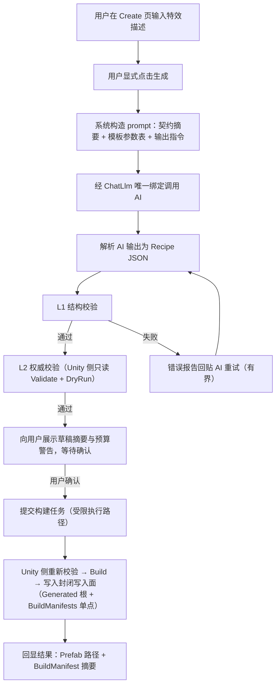

# REQ-001 对话生成单个 Unity 特效（Chat → VFX）产品需求

> 状态：DRAFT（待主 agent 验收）｜任务卡：R1（`docs/plans/OPTIMIZATION_MASTER_PLAN.md`）｜创建：2026-08-29
>
> 本文定义"用户通过文字对话生成单个 Unity 特效"的完整产品需求，是 Phase 3 任务 F1（Recipe 结构化生成通道）与 F2（受限构建执行）的需求依据，也是 R4（ADR-007 项目写入安全设计）的输入。
>
> 权威边界继承：`PROJECT_ARCHITECTURE_AND_DEVELOPMENT.md`（AI 双通道、只读链路、无自动项目写入）、`docs/rules/ADR-005`、`docs/rules/ADR-006`。本文不推翻任何已关闭里程碑（U0–U6、A0–A6）的结论；涉及"向 Unity 项目写入"的能力属于新里程碑范围，由 F2 + ADR-007 落地。
>
> 代码映射基于 P0-1 合并验收后的 master（2026-08-29）：AI 通道与 Protocol 命令面代码已全部在主线（`src/VFXComposer.AI.Providers`、`src/VFXComposer.AI.Contracts`、`src/VFXComposer.Protocol` 等），第 7 节映射已经独立审计核实。

## 1. 背景

仓库现状具备两块相互独立、尚未连通的能力：

1. **AI ChatLlm 通道**（A0–A6 已关闭）：Desktop 内显式绑定、零 fallback、零自动网络的文本对话通道（`ChatChannelGateway`），当前 Create 页只做纯文本聊天，不产出任何结构化产物。
2. **Unity 侧特效编译能力**（S1–S11 历史阶段产物）：以 Recipe JSON 为输入的校验器（`RecipeValidator`）与编译器（`VfxCompiler` 及各模板族编译器），能把合法 Recipe 幂等地编译为 Prefab，资产写入限定在 `Assets/VFX/Generated`，并在 `ProjectSettings/VFXComposer/BuildManifests/` 下写审计 manifest（两者即 ADR-007 定版的封闭双成员写入面）。历史执行计划（`docs/EXECUTION_PLAN.md` S9）已验证过"文字需求 → AI 写 Recipe → Validate → 修复 → Build"的人工流程可行。

本需求把这条人工流程产品化：用户在 Desktop 输入一句特效描述，系统经 AI 生成 Recipe 草稿、分层校验、用户确认后，由受限执行路径构建出单个 Prefab。

## 2. 术语

| 术语 | 含义 |
|---|---|
| Recipe | 特效的视觉决策记录（JSON），契约见 `docs/ai-workflow/recipe-v1.schema.json`（v1，契约修订 1.4） |
| Recipe 草稿 | AI 生成、尚未通过全部校验或尚未经用户确认的 Recipe JSON，只存在于用户应用数据，不进入 Unity 项目 |
| L1 校验 | .NET 侧结构校验：JSON 合法性、必填字段、枚举、类型、未知字段拒绝（以 schema 契约为依据） |
| L2 校验 | Unity 侧权威校验：`RecipeValidator` + `ArchetypeParameterRegistry` + `ContentParameterRegistry` + `TemplateCatalog` manifest + `BudgetCalculator`，语义与预算的唯一权威 |
| 生成任务 | 用户一次显式"生成"动作触发的完整流水（AI 调用 + 重试 + 校验），产出至多一份 Recipe 草稿 |
| 构建任务 | 用户确认草稿后提交的 Unity 侧执行单元（Validate → DryRun → Build），产出至多一个 Prefab |
| 受限执行路径 | Unity batchmode `-executeMethod`（复用 `tools/Invoke-Unity.ps1` 路径）或 Worker 命令面（`ValidateRecipeCommand`/`BuildCandidateCommand`）两种候选，由 F2 + ADR-007 定版 |

## 3. 目标

1. 用户在 Desktop 输入一段自然语言特效描述，点击一次"生成"，得到一份通过 L1 校验的 Recipe v1 草稿。
2. AI 输出不合契约时，系统在有界次数内携带精确错误报告自动重试，用户无需理解 JSON。
3. 草稿经用户显式确认后才提交构建；构建经 Unity 侧权威校验与受限写入路径产出 Prefab，写入面限定为 ADR-007 定版的封闭双成员清单（`Assets/VFX/Generated/**` 与 `ProjectSettings/VFXComposer/BuildManifests/` 审计元数据单点，细则见 REQ-001-18）。
4. 全流程 fail-closed：任何一步失败都以稳定错误码呈现并停止，不静默降级、不换 provider、不绕过校验。
5. 全流程可审计但不泄密：日志只含稳定错误码与脱敏摘要，不含 prompt 原文、endpoint、secret。

## 4. 非目标

1. **不做封闭写入面之外的任何自动写入**：构建任务的写入面为 ADR-007（`docs/rules/ADR-007_CONTROLLED_PROJECT_MUTATION.md`，已定版）裁决的封闭双成员清单——①资产产物唯一根 `Assets/VFX/Generated/**`；②审计元数据单点 `ProjectSettings/VFXComposer/BuildManifests/<effectId>.manifest.json`（`VfxCompiler` 既有代码事实：构建必写 manifest）。AI 产物不写模板目录、不写任意用户路径；除上述单点外 `ProjectSettings/**` 保持只读；模板族共享资产（`Assets/VFX/Shared/**`）不在写入面内，构建任务对其只读。越界即 fail-closed。
2. **不做 AI 自动选 provider**：ChatLlm 通道保持唯一显式绑定、零 fallback（ADR-006）；通道未绑定即失败，不自动推断、不换 route、不换模型。
3. **单特效、单对话轮次**：一次生成任务对应一段用户描述、产出至多一个特效；不支持跨任务对话记忆、不支持"在上一个特效基础上改一改"（Patch/多轮迭代属后续需求）；生成任务内部的校验重试不是新的对话轮次。
4. **不做批量生成**（REQ-002 范围）、**不做任务队列语义**（REQ-003 范围）：本需求只要求"同一时刻至多一个构建任务在执行"这一约束成立。
5. **不做 Recipe v2（S12 Slash）对话生成**：`S12SlashCompiler` 是隔离编译器且只拥有唯一管理产物 `slash_3d_stylized`；首版对话生成只覆盖 Recipe v1（`VfxCompiler` 所辖），可选 archetype/模板以运行时 `TemplateCatalog` 实际登记为准。
6. **不做自动视觉评审**：Prefab 是否"好看"由用户在 Unity 中人工判断；本需求的成功判据止于"合法 Recipe 构建出合法 Prefab"。
7. **不承诺真实付费 provider 的可用性**：验收使用 mock/loopback（继承 A5/A6 边界）。

## 5. 用户流程

### 5.1 正常流

要点：

- 步骤 A 到 B 之间零网络；只有 B 的显式动作触发网络请求（继承 ADR-006 zero-auto-network）。
- L2 校验（步骤 G）是只读的：`RecipeValidator.Validate` 与 `VfxCompiler.DryRun` 不修改任何资产。用户确认发生在看到 L2 结论（含 `BudgetCalculator` 的预算警告）之后。
- 步骤 J 的构建入口必须重新执行校验（`VfxCompiler` 的生产路径已内建"计划-提交一致性"复核），确认与构建之间的草稿篡改会被拒绝。
- 一次生成任务结束后，草稿与结果留存于用户应用数据；重新生成是新的显式动作。

### 5.2 失败流

| 编号 | 失败点 | 系统行为 | 用户所见 |
|---|---|---|---|
| X1 | ChatLlm 通道未绑定 / profile 禁用 / secret 不可用 | 发起网络请求前 fail-closed，映射 `ChatChannelErrorCode`（如 `ChannelUnbound`） | 稳定错误提示 + 指向 Settings 的引导；无网络请求发生 |
| X2 | 网络失败 / 超时 / 上游拒绝 / 响应超限 | 映射稳定错误码（`TimedOut`、`UpstreamUnavailable`、`ResponseTooLarge` 等）；不自动跨 route 重试 | 错误提示 + "重新生成"入口（新的显式动作） |
| X3 | AI 输出无法解析为 JSON，或含未知字段、坏枚举、越界值（L1 失败） | 生成结构化错误报告（`code`/`path`/`message`/`actualValue`/`allowedRange`），以修复话术回贴 AI，自动重试；重试上限内仍失败则任务失败 | 重试过程有进度提示；最终失败时展示最后一版草稿 + 完整错误报告 |
| X4 | L2 校验失败（模板不存在、参数越界、预算超限、能力/槽位不符） | Unity 侧错误报告（E3xx 等，定位到 stage/module/参数路径）回显；可选择将报告回贴 AI 重试（计入同一重试预算）；超限则任务失败 | 精确到字段的错误列表；不产生任何写入 |
| X5 | 用户拒绝确认 / 放弃 | 草稿留存于用户应用数据，可删除；流程终止 | 无任何 Unity 项目写入 |
| X6 | 构建执行失败（编译器异常、绑定失败、Unity 实例锁被占用） | 构建任务失败并回显失败报告；上一次成功产物不被破坏（原子替换语义）；锁占用时明确提示"关闭 Unity 编辑器后重试" | 失败原因 + 稳定错误码 |
| X7 | 编译器输出路径越界（防御性） | `VfxCompiler` 以 `E600` 拒绝，构建标记 Blocked | 构建失败报告；无写入 |
| X8 | 任务中取消（用户显式取消） | AI 调用经 `CancellationToken` 取消（`Cancelled`）；构建任务的取消语义遵循 REQ-003/Protocol Job 合同 | 任务标记已取消；无半成品写入 |

## 6. 功能需求

每条需求可独立测试。"必须"为验收硬条件。

### 6.1 输入与触发

- **REQ-001-01** Create 页必须提供特效描述输入区：非空、有界（UTF-8 编码后 ≤ 16 KiB，与 `ChatChannelLimits.MaximumRequestBytes` 的 256 KiB 请求预算兼容并留出 prompt 模板余量）；空白输入时生成按钮不可用。
- **REQ-001-02** 网络请求必须且只能由用户显式"生成"动作触发；输入、导航、打开 Create 页均零网络。测试：导航与输入过程断言无任何 HTTP 活动。
- **REQ-001-03** 一次生成任务必须至多产出一份 Recipe 草稿（单特效）；任务不读取此前任务的对话历史（单对话轮次）。测试：连续两次生成任务，断言第二次的 prompt 不含第一次的消息。

### 6.2 Prompt 构造与 AI 调用

- **REQ-001-04** prompt 必须由版本化模板构造，内容至少含：Recipe v1 契约约束（源自 `docs/ai-workflow/recipe-v1.schema.json` 或其等价摘要）、可用模板/参数表（源自 `TemplateCatalog` manifest 的导出物，含 min/default/max）、输出格式指令（仅输出一个 JSON 对象）。模板版本必须记入任务元数据。测试：固定输入下 prompt 构造是确定性的（快照测试）。
- **REQ-001-05** AI 调用必须走 ChatLlm 通道的唯一显式绑定（`IAiGateway` / `ChatChannelGateway`）；禁止在本功能内选择 profile、model、endpoint、协议或实现任何 fallback。通道未绑定/配置无效时必须在网络前失败（X1）。测试：未绑定状态断言零网络 + 稳定错误码。
- **REQ-001-06** 当绑定协议可用结构化输出时，应使用 `ChatStructuredOutput`（schema ≤ 32 KiB）约束输出；不可用时退化为纯文本 + 解析（两者是同一显式绑定内的请求形态差异，不是 route 切换）。两种形态的产物必须进入同一解析/校验管线。测试（等价判定）：对承载同一语义 Recipe 的 mock 响应分别走两种形态，断言两者产出的草稿 JSON 在规范化序列化后逐字节相等，即规范化哈希（`RecipeCanonicalizer.ComputeSha256` 同源规则：对象键按 ordinal 排序、数组保序、数值固定格式化）一致。比较覆盖草稿全部字段，不忽略任何字段；字符串值区分大小写并保留值内空白；仅 JSON 结构性空白、键顺序、markdown 围栏等包装差异被规范化消除。
- **REQ-001-07** AI 请求与响应必须有界：遵守 `ChatChannelLimits`（消息数、请求/响应字节、结果字符）；越界映射稳定错误码，不截断续传。

### 6.3 解析与 L1 校验

- **REQ-001-08** 解析器必须能从 AI 文本中提取单个 JSON 对象（容忍 markdown 代码围栏与前后缀说明文字），提取失败即 L1 失败；严禁执行 AI 输出中的任何指令性内容。
- **REQ-001-09** L1 校验必须拒绝：未知字段（不静默忽略——继承 S2/S4 教训）、缺失必填、坏枚举、类型不符、`recipeVersion != 1`。测试：每类非法样例各至少一条，错误路径精确。
- **REQ-001-10** L1 错误报告格式必须为 `{ code, severity, path, message, actualValue, allowedRange }`，与 Unity 侧 `ValidationReport`（`project/Packages/com.vfxcomposer.unity/Editor/Validation/`）字段对齐，使 AI 修复话术对两层报告可用同一模板。

### 6.4 失败重试

- **REQ-001-11** L1/L2 校验失败时，系统必须将错误报告以固定修复话术回贴 AI 自动重试；重试话术必须包含：原始需求摘要、失败的完整错误列表、"只修复列出的错误、不改动其他字段"的指令。
- **REQ-001-12** 自动重试必须有界：默认上限 2 次（可配置，上限 ≤ 5），耗尽后任务失败并完整保留最后草稿与错误报告。重试是同一生成任务内、同一已解析 route 上的后续请求，不构成 route 变更（与 ADR-006 一致）。测试：mock 恒定坏输出，断言恰好 1 + N 次请求后停止。
- **REQ-001-13** 网络类失败（X2）不得自动重试，必须由用户显式重新发起。测试：mock 超时，断言仅 1 次请求。

### 6.5 用户确认与草稿留存

- **REQ-001-14** 构建任务必须以用户对具体草稿的显式确认为前置；确认界面必须展示：Recipe `id`、`archetype`、`dimension`、`targetProfile`、模板与关键参数清单、L2 校验结论与预算警告（`BudgetCalculator` 输出）。无确认则零 Unity 项目写入。
- **REQ-001-15** 草稿、校验报告、任务元数据必须保存在当前用户应用数据目录（非 Unity 项目路径），用户可查看与删除；确认提交时以草稿的规范化哈希（`RecipeCanonicalizer.ComputeSha256` 同源算法）绑定确认对象，确认后草稿变更必须使确认失效。
- **REQ-001-16** 用户描述原文、prompt 原文、AI 原始响应不得写入日志/诊断/遥测（redaction，继承 CODING_STANDARDS §3.1）；草稿 JSON 本身可持久化（它是产物而非 prompt）。

### 6.6 构建执行（F2 实现，需求边界在此定义）

- **REQ-001-17** 构建任务必须经受限执行路径执行 Unity 侧完整流水：`RecipeValidator` 校验 → `VfxCompiler` DryRun → Build；Desktop 进程自身不得对 Unity 项目做任何文件 I/O（继承 ADR-005 边界）。
- **REQ-001-18** 所有构建写入必须落在 ADR-007 定版的封闭双成员写入面之内：①`VfxCompiler.GeneratedRoot`（`Assets/VFX/Generated/**`，资产产物唯一根）；②`ProjectSettings/VFXComposer/BuildManifests/<effectId>.manifest.json`（审计元数据单点，构建必写）。越界目标必须被拒绝（`E600` 行为）且有负向测试。模板目录、`Assets/VFX/Shared/**`、以及上述单点之外的 `ProjectSettings/**` 对构建任务只读；越界即 fail-closed。
- **REQ-001-19** 构建必须满足原子性与幂等：失败不破坏上一次成功产物；同一草稿重复构建第二次 DryRun 结果为 Unchanged（继承既有编译器语义，作为端到端断言复述）。
- **REQ-001-20** 同一时刻至多一个构建任务持有 Unity 实例（单实例锁）；锁不可得时构建任务必须显式失败或排队等待（排队语义由 REQ-003 定义），禁止并发抢锁。
- **REQ-001-21** 构建完成必须向用户回显：成功时 Prefab 资产路径 + `BuildManifest.json` 摘要（recipe 哈希、build 哈希、编译器版本）；失败时定位到 stage/module/参数路径的错误列表。

### 6.7 可观测与安全

- **REQ-001-22** 全流程各步骤失败必须映射稳定错误码（复用 `ChatChannelErrorCode`、Unity 侧 E3xx/E6xx 词表；新增码需登记），禁止把原始异常文本直接呈现或落日志。
- **REQ-001-23** 任务时间线（各步骤起止、重试次数、错误码序列）必须可查询，用于验收与排障；时间线内容遵守 REQ-001-16 的脱敏约束。

## 7. 与现有代码/schema 的映射

| 需求 | 现有组件（路径） | 状态 |
|---|---|---|
| REQ-001-01/02/03 输入与触发 | `apps/VFXComposer.Desktop` Create 页（现为纯文本聊天） | 部分：页面存在，需 F1 改造为生成任务入口 |
| REQ-001-04 prompt 数据源（契约） | `docs/ai-workflow/recipe-v1.schema.json` | 已有：schema 契约可直接嵌入/摘要 |
| REQ-001-04 prompt 数据源（模板参数表） | `TemplateCatalog`（`project/.../Editor/Catalog/TemplateCatalog.cs`）+ 参考先例 `docs/ai-workflow/s12-slash-v3/manifest.generated.json`、`Editor/Workflow/S12SlashAiExporter.cs` | 缺口 G-6：v1 目录的导出物与送达 Desktop 的通道均不存在 |
| REQ-001-05 唯一绑定调用 | `src/VFXComposer.AI.Providers/Chat/ChatChannelGateway.cs`、`ChatRouteResolver.cs`；契约 `src/VFXComposer.AI.Contracts`（`IAiGateway`、`ChatChannelRequest`） | 已有 |
| REQ-001-06 结构化输出 | `ChatStructuredOutput`（`src/VFXComposer.AI.Contracts/Chat/ChatChannelContracts.cs`）、`IChatChannelGateway.CompleteAsync` | 部分：契约与网关已有；但 Desktop 面向 feature 的 `IAiGateway.ChatAsync` 不暴露结构化输出（缺口 G-5） |
| REQ-001-07 请求/响应有界 | `ChatChannelLimits`、`ChatProtocolCodec.cs` | 已有 |
| REQ-001-08/09/10 解析与 L1 校验 | 无（.NET 侧目前没有 Recipe 模型/解析/校验代码） | 缺口 G-2（F1 核心） |
| REQ-001-10 报告格式对齐 | Unity 侧 `ValidationReport`（`Editor/Validation/`），错误码 E3xx | 已有格式基准；.NET 侧需按同构格式新建 |
| REQ-001-11/12/13 重试话术 | 历史先例：`docs/ai-workflow/evidence/cohort-k/`（修复回合证据）、`docs/EXECUTION_PLAN.md` S2 结论 | 缺口 G-3（F1） |
| REQ-001-14 确认 UI | 无 | 缺口 G-4（F1） |
| REQ-001-15 草稿留存 | 参照 `ProviderConfigurationStore` 的用户应用数据+原子写模式（仅模式参照，不复用实例） | 缺口 G-4（F1） |
| REQ-001-16/22/23 redaction 与稳定码 | `AiContractGuard`、`ChatChannelErrorCatalog`、CODING_STANDARDS §3 | 已有词表与守卫；新流水需接入 |
| REQ-001-17 L2 校验 | `Editor/Validation/RecipeValidator.cs`、`ArchetypeParameterRegistry.cs`、`ContentParameterRegistry`、`Editor/Validation/BudgetCalculator.cs` | 已有（Unity 侧完备） |
| REQ-001-17/18/19 编译与写入限制 | `Editor/Build/VfxCompiler.cs`（`GeneratedRoot`、`E600`、DryRun/BuildProduction、`W24S5ProductionGate`）；模板族 `Editor/Impact2D/Impact2DCompiler.cs`、`Editor/Area2D/Area2DCompiler.cs`（同 `GeneratedRoot`）；隔离的 `Editor/SlashV2/S12SlashCompiler.cs`（v2，非本需求范围） | 已有；但从 Desktop 触达它的执行通道不存在（缺口 G-7） |
| REQ-001-17 受限执行路径候选 A | `tools/Invoke-Unity.ps1` + batchmode `-executeMethod` | 部分：脚本存在，无生成任务专用入口方法 |
| REQ-001-17 受限执行路径候选 B | Protocol 命令面 `src/VFXComposer.Protocol/Commands/ValidateRecipeCommand.cs`、`BuildCandidateCommand.cs`（wire DTO，只携带哈希标识，"raw recipe JSON is never a formal ticket"） | 部分：DTO 已有；Broker/Worker 无命令执行实现，且 recipe 字节如何抵达 Unity 侧未定义（缺口 G-7） |
| REQ-001-20 单实例锁 | `docs/EXECUTION_PLAN.md` §3.2 已记录 batchmode 项目锁约束；无代码化调度 | 缺口 G-8（与 F3 共界） |
| REQ-001-21 结果回显 | `BuildManifest.json`（`VfxCompiler.ManifestFileName`）；Worker 只读白名单含 `ProjectSettings/VFXComposer/BuildManifests/{id}.manifest.json` | 部分：产物清单已有；回传链路缺（G-7/G-8） |

## 8. 缺口清单（与 F1/F2 边界对应）

F1 = 生成 + 解析 + 校验（产物止于"通过校验、待确认的 recipe 草稿"，不写 Unity 项目）；F2 = 构建执行（确认后的草稿 → Prefab）。

| 缺口 | 内容 | 归属 | 对应需求 |
|---|---|---|---|
| G-1 | prompt 模板子域：版本化模板、契约摘要嵌入、确定性构造 | F1 | REQ-001-04 |
| G-2 | .NET 侧 Recipe 解析器 + L1 结构校验器 + 同构错误报告 | F1 | REQ-001-08/09/10 |
| G-3 | 校验失败自动重试回路（修复话术、重试预算、终止条件） | F1 | REQ-001-11/12/13 |
| G-4 | Desktop Create 页生成任务接线、确认 UI、草稿留存 | F1 | REQ-001-01/02/03/14/15 |
| G-5 | 结构化输出的 feature 暴露：`IAiGateway` 仅有 `ChatAsync(ChatRequest)`，`ChatStructuredOutput` 停留在 `IChatChannelGateway` 层；F1 需扩展 desktop 契约或在 Providers 内部组合 | F1 | REQ-001-06 |
| G-6 | 模板参数表送达通道：Worker 只读白名单目前仅 `LIBRARY_INDEX` 与 BuildManifests，`Assets/VFX/Templates` 下的 manifest 无法经现有只读链路到达 Desktop；候选：`S12SlashAiExporter` 模式的静态导出快照（v1 目录版）或扩展只读白名单（需走边界变更评审） | F1（快照方案）或 F2/ADR-007（白名单方案） | REQ-001-04 |
| G-7 | 受限构建执行器：batchmode 入口方法（或 Worker 命令实现）、recipe 字节的受控投递、`W24S5ProductionGate` 请求构造或 legacy Build 路径的取舍 | F2 | REQ-001-17/18/19/21 |
| G-8 | 构建任务的锁调度与结果回传（与 F3 Jobs 队列共界，本需求只要求"至多一个 + 失败显式"） | F2（最小实现）/F3（队列化） | REQ-001-20/21 |
| G-9 | 写入安全设计：路径 containment 细则、`Assets/VFX/Shared/**` 共享资产的处理、原子写入/回滚、fail-closed 行为——已由 ADR-007 定版闭合（双成员封闭写入面），F2 按其实现 | R4（ADR-007，已交付） | REQ-001-18 |

## 9. 风险与开放问题

### 9.1 调研发现的风险

- **R-1 写入根表述不一致（已解决，2026-08-29）**：主计划与 CODING_STANDARDS 曾写"`Assets/Generated`"，与代码实际的 `VfxCompiler.GeneratedRoot = "Assets/VFX/Generated"` 不一致；两份文档均已更正为 `Assets/VFX/Generated`，本文与代码、治理文档三方一致。`Assets/VFX/Shared/**` 的写入政策已由 ADR-007 裁决为只读（见 R-2）。
- **R-2 共享资产写入超出 Generated**：`Impact2DSharedLibrary`/`Area2DSharedLibrary` 的 `Ensure()` 会在 `Assets/VFX/Shared/<Family>` 下补建材质/网格并配置纹理导入。若构建任务触发这些路径，封闭写入面即被突破。ADR-007 已裁决（定版）：`Assets/VFX/Shared/**` 不在双成员写入面内，构建任务对其只读（依赖缺失即失败），`Ensure()` 类共享资产补建不得由构建任务触发；剩余风险是 F2 实现必须实际拦截该路径。
- **R-3 语义权威在 Unity 侧**：schema 对 `parameters`/`archetypeParameters`/`content.parameters` 是开放的（`additionalProperties: true`），权威校验在 C# registries 与 live `TemplateCatalog`。L1 通过 ≠ 可构建；确认前必须拿到 L2 结论，这使"确认前跑一次 Unity 只读校验"成为流程硬依赖，Unity batchmode 冷启动（分钟级）直接决定交互体验。是否引入常驻 Unity 会话属 F2/F3 设计题。
- **R-4 结构化输出的协议差异**：`ChatProtocolIds` 支持 4 种协议，各家对 JSON Schema 约束输出的支持程度不一；REQ-001-06 的"退化为纯文本"路径必须是一等公民而非兜底摆设，否则部分绑定下功能不可用。
- **R-5 编译能力碎片化**：schema 的 archetype 枚举有 20 个值，但实际可编译的模板族有限（v1 `VfxCompiler` + Impact2D/Area2D 域 + 隔离的 v2 Slash）。若 prompt 把全部枚举暴露给 AI，会生成大量"合法但不可构建"的 Recipe。F1 的 prompt 必须以运行时 Catalog 实际登记的模板集为准收窄选项（依赖 G-6 的数据通道）。
- **R-6 生产闸取舍**：`VfxCompiler.BuildProduction` 要求 `W24S5ProductionGateRequest`（contract-first 准入），legacy `Build` 仍源兼容保留。F2 走哪条路径影响 REQ-001-19 的验收方式与 ADR-007 的威胁模型，需要在 F2 开工前定版。
- **R-7 自动重试与零自动网络的边界**：ADR-006 语境下"网络请求由用户/任务的显式动作触发"。本文将"生成任务内有界重试"解释为同一显式动作的组成部分（REQ-001-12），该解释需在 R4/ADR-007 评审时确认，避免与"无自动网络"声明冲突。
- **R-8 基线漂移（已解决，2026-08-29）**：P0-1 已完成合并并验收，Chat 通道与 Protocol 命令面代码均在 master，第 7 节映射已按主线路径核实，本条不再构成风险。
- **R-9 Unity 单实例锁**：用户开着 Unity 编辑器时 batchmode 必然失败（项目锁）。X6 的提示语义已覆盖，但这会是实际使用中最高频的失败路径，F2 需要把锁检测做成前置探测而非事后报错。

### 9.2 开放问题（不阻塞 F1 开工）

- O-1 描述输入是否支持参考图（走 ImageGeneration 通道反向描述）——超出本需求，另立需求卡。
- O-2 草稿的保留份数与清理策略（建议：每任务一份、总量有界、用户可清空）。
- O-3 L2 校验失败自动回贴 AI（X4 可选路径）是否默认开启，还是要求用户逐次确认。

## 10. 验收场景

> 场景中 AI 均为 mock/loopback（无真实付费调用）；"Generated 根"指 `Assets/VFX/Generated`。

**AC-1 正常流端到端**
- Given：ChatLlm 通道已绑定 mock provider，mock 返回一份合法 fireball Recipe v1；Unity 项目干净且模板齐备
- When：用户输入"生成一个 2D 卡通火球"，点击生成，L1/L2 通过后确认提交
- Then：构建成功；Generated 根下出现该 recipe id 的 Prefab 与 `BuildManifest.json`；任务时间线记录 1 次 AI 请求、0 次重试；日志无 prompt 原文

**AC-2 AI 输出不合 schema 后修复成功**
- Given：mock 第一次返回含未知字段 `foo` 与越界 `rate` 的 JSON，第二次返回合法 Recipe
- When：用户点击生成
- Then：L1 拒绝首次输出并产出含精确 `path`/`allowedRange` 的错误报告；系统自动回贴重试恰好 1 次；最终草稿通过校验进入确认态；时间线记录 2 次 AI 请求

**AC-3 重试预算耗尽**
- Given：mock 恒定返回非 JSON 文本；重试上限配置为 2
- When：用户点击生成
- Then：恰好发生 3 次 AI 请求（1 + 2）后任务失败；最后一版原始输出与错误报告可查看；Unity 项目零写入；无额外网络请求

**AC-4 通道未绑定 fail-closed**
- Given：ChatLlm 通道无绑定
- When：用户点击生成
- Then：零网络请求；界面显示 `ChannelUnbound` 对应的稳定错误与 Settings 引导；任务立即终止

**AC-5 L2 语义校验拦截**
- Given：mock 返回结构合法但 `templateId` 不存在于 Catalog 的 Recipe
- When：生成任务进入 L2 校验
- Then：返回 `E308` 类错误且 `path` 定位到具体 module；不进入确认态；Unity 项目零写入

**AC-6 用户拒绝确认**
- Given：草稿已通过 L1/L2 校验并进入确认态
- When：用户选择放弃
- Then：Unity 项目零写入；草稿保留在用户应用数据且可删除；再次生成为全新任务

**AC-7 越界写入被拒**
- Given：构造一个经受限执行路径提交、输出路径解析到 Generated 根之外的构建请求（负向测试注入）
- When：执行构建
- Then：构建被 `E600` 行为拒绝并标记 Blocked；封闭写入面（Generated 根与 BuildManifests 单点）之外无任何新文件；上次成功产物不变

**AC-8 网络失败不自动重试**
- Given：mock provider 超时
- When：用户点击生成
- Then：恰好 1 次网络请求；显示 `TimedOut` 稳定错误；用户可显式重新发起，形成新任务

**AC-9 幂等重建**
- Given：AC-1 已成功构建
- When：用户对同一草稿再次提交构建
- Then：DryRun 结果为 Unchanged；资产无变化；结果回显注明未变更

## 11. 变更记录

| 版本 | 日期 | 变更 |
|---|---|---|
| v0.1 | 2026-08-29 | 初版（任务卡 R1 交付） |
| v0.2 | 2026-08-29 | 审计建议微调：映射路径改为 P0-1 合并后的 master 路径（S-1）；R-1/R-8 标记已解决（S-2）；REQ-001-06 等价判定量化（S-3） |
| v0.3 | 2026-08-29 | 对齐已定版的 ADR-007 双成员封闭写入面：修正 §4 非目标 1 与 REQ-001-18（`ProjectSettings/VFXComposer/BuildManifests/` 审计元数据单点可写、其余 `ProjectSettings/**` 只读），同步 §3 目标、§5.1 流程图、AC-7、R-1/R-2、G-9 的同义表述 |
