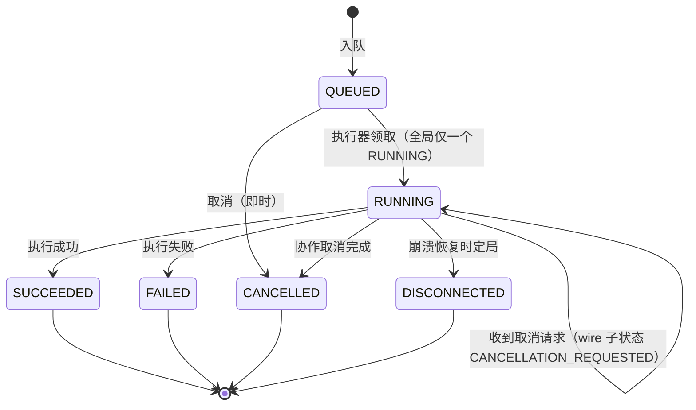

# REQ-003：Jobs 串行队列产品需求（PRD）

> 状态：DRAFT（待主 agent 验收）｜任务卡：R3｜创建：2026-08-29｜作者：开发子 agent
>
> 上游：`docs/plans/OPTIMIZATION_MASTER_PLAN.md` Phase 1 任务卡 R3。对应实现任务：**F3（Jobs 串行队列 + Desktop Jobs 页）**；与 F2（受限构建执行）、F4/F5（批量入口，见 `docs/requirements/REQ-002_BATCH_CLI_MCP.md`）存在接缝。
>
> 分工：本文定义任务生命周期、单并发调度、持久化与崩溃恢复、进度与取消、Desktop Jobs 页；批量入口面与批量语义归 REQ-002。
>
> 本文档为纯新增需求文档，不修改任何现有文件；与主计划表述冲突时以主计划裁决。

---

## 1. 背景与根本约束

- 产品目标三大缺口之三是"受机器配置限制的串行 Jobs 队列"（主计划 §1）。
- **根本约束（机器约束）**：Unity 同一项目同时只能被一个编辑器实例打开——编辑器开着该项目时 batchmode 会因项目锁失败（`docs/EXECUTION_PLAN.md` §3.2 已知限制、§12.2 坑清单"batchmode 与编辑器实例争抢项目锁"）。因此对同一 Unity 项目的一切构建类任务必须**全局并发 = 1**，这是队列必须单并发的根本原因，不是性能取舍。
- 现有锁处置先例：`tools/Invoke-Unity.ps1` 已实现"检测该项目的 Unity.exe 进程 → exit 73 拒绝启动；陈旧锁文件仅告警；超时只终止记录的精确 PID"。
- 现有合同：`src/VFXComposer.Protocol/Jobs/` 与 `src/VFXComposer.Protocol/Commands/` 已提供完整的 Job 事件与命令 DTO（词表见 §5）；本队列**必须与这些合同兼容，不得另立状态词表**。
- 现有 UI：Desktop Jobs 页为占位（`apps/VFXComposer.Desktop/ViewModels/JobsViewModel.cs`：“Structured worker progress, logs and cancellation arrive in Phase 3.”）。本需求即其 Phase 3 实体化。
- 顺序治理先例：`docs/allwork/00_INDEX_AND_ACCEPTANCE.md`"按文件编号从小到大逐个开发"——串行队列把这一治理纪律程序化。

## 2. 目标与非目标

### 2.1 目标

- **O1** 提供当前用户本机的持久化任务队列：入队、严格 FIFO 串行执行、状态/进度/日志/产物事件、取消。
- **O2** 全局并发恒为 1，跨进程强制（Desktop、CLI、MCP 三个入口合流同一队列）。
- **O3** 崩溃/重启后队列状态可恢复：排队任务不丢失，运行中任务有明确定局，生成区不被污染。
- **O4** Desktop Jobs 页从占位变为真实的列表 + 详情 + 取消界面。
- **O5** 状态、进度、取消、完成语义与 Protocol Job DTO 一一映射，不发明并行词表。

### 2.2 非目标

- **N1** 不做并行执行、优先级、抢占、插队；FIFO 是唯一顺序。
- **N2** 不做多机/远程队列、不做网络暴露；队列是当前用户本机设施。
- **N3** 不做定时任务、周期任务、依赖图调度。
- **N4** 不做失败任务的自动重试（fail-closed；重试是用户显式重新入队的新任务）。
- **N5** 不做队列内容的跨用户共享；存储在当前用户应用数据下。
- **N6** 不实现构建/生成本身（F1/F2 职责）；队列只负责"何时、以何序、单飞地"驱动它们。
- **N7** v1 不做队列级暂停/恢复开关（等待项目锁的自动等待态除外，见 §6.3）。
- **N8** 不把 receipt/authority 语义引入队列：job 事件只是事实数据（`JobEventEnvelope` 注释明示），不构成任何验收结论。

## 3. 术语与角色

| 术语 | 含义 |
|---|---|
| Job | 队列中一次可执行工作（校验、构建、生成等）的记录与生命周期载体；一个 REQ-002 清单条目对应一个 job |
| 批次（batch） | 来自同一清单提交的一组 job 的分组（`batchId`）；批次策略（onFailure）随组持久化 |
| 入口（entry surface） | Desktop（Chat 单条）、CLI、MCP；只能入队/查询/请求取消，不执行 |
| 执行器（executor） | 全局唯一的消费侧：按 FIFO 取 job、驱动 F2 执行路径、发布事件；唯一性跨进程强制 |
| 队列存储（job store） | 当前用户应用数据下的持久化状态（快照 + 事件日志） |

## 4. 用户流程

1. **提交**：用户在 Desktop Create 页发起单条生成，或经 CLI/MCP 提交批量（REQ-002）；每条立即获得 `jobId` 并进入 `QUEUED`。
2. **观察**：用户打开 Desktop Jobs 页（或 `vfxc queue list` / MCP `vfx_job_status`），看到列表、当前运行项、进度百分比与队列级状态。
3. **等待/干预**：若 Unity 编辑器占用项目，页面显示"等待项目锁"横幅；用户关闭编辑器后队列自动继续；用户可随时取消任意非终态 job。
4. **完局**：job 到终态后展示结果与稳定诊断码；失败/断连的 job 可一键"重新入队"（生成新 `jobId` 的新 job，原 job 保留为审计记录）。
5. **崩溃恢复**：Desktop/执行器崩溃或整机重启后，重新启动即恢复队列：排队任务原序继续，此前运行中的任务定局为 `DISCONNECTED`。

## 5. 任务生命周期状态机

### 5.1 状态词表（与 Protocol 对齐，闭集）

队列状态字符串**必须**精确取自 `JobStatusStates`（`src/VFXComposer.Protocol/Jobs/JobStatus.cs`）：`QUEUED` / `RUNNING` / `SUCCEEDED` / `FAILED` / `CANCELLED` / `DISCONNECTED`。禁止新增或改写。

### 5.2 与 Protocol DTO 的映射

| 队列状态 | `JobStatusStates` | `JobProgressStates`（wire 进度） | `JobCompletionOutcomes`（wire 完成） | 诊断要求 |
|---|---|---|---|---|
| 排队 | `QUEUED` | `QUEUED` | — | — |
| 运行 | `RUNNING` | `RUNNING` | — | — |
| 运行（取消中） | `RUNNING` | `CANCELLATION_REQUESTED` | — | — |
| 成功 | `SUCCEEDED` | — | `SUCCEEDED` | 必须无 diagnostic |
| 失败 | `FAILED` | — | `FAILED` | 必须有 `StableDiagnostic` |
| 取消 | `CANCELLED` | — | `CANCELLED` | 必须有 `StableDiagnostic` |
| 断连（崩溃定局） | `DISCONNECTED` | — | `DISCONNECTED` | 必须有 `StableDiagnostic` |

- "取消中"不是独立队列状态：它是 `RUNNING` 期间对外发布 `JobProgress.State = CANCELLATION_REQUESTED` 的子阶段，与 `JobProgressStates` 闭集一致。
- 完成事件的 diagnostic 形状约束直接继承 `JobCompletion` 构造器规则（成功不得带诊断、非成功必须带诊断）。

### 5.3 迁移规则

1. 终态（`SUCCEEDED`/`FAILED`/`CANCELLED`/`DISCONNECTED`）不可再迁移；对终态 job 的任何操作是幂等 no-op 并返回当前状态。
2. 每次迁移追加持久化事件，`eventSequence` 每 job 严格单调递增（`JobEventEnvelope` 要求 `eventSequence > 0`）且跨崩溃连续（last sequence 持久化）。
3. `progressPermille` 单调不减，取值 0–1000（`JobProgress.MaximumPermille`）；1000 仅出现于成功终态前的最后进度。
4. 失败原因不进状态：状态只表阶段，原因一律走 `StableDiagnostic` 稳定码（不得出现叙述性自由文本作为机器判据）。
5. 重试 = 新 job：任何终态 job 的"重新入队"产生新 `jobId`/`requestId`/`idempotencyKey`（三者互异——现有代码中互异校验位于 `CommandEnvelope.RequireDistinctIdentityTokens` 与 `JobCorrelation` 的结构互异约束；`JobIdentity` 本身仅逐字段 `Guard.Token`、不做互异校验，其三字段互异是本 PRD 的附加要求，与 REQ-002 §9.3 一致），原 job 记录不改写；内容派生的条目幂等键不变（§7.1）。

## 6. 单并发调度约束

### 6.1 全局并发 = 1

- 任意时刻至多一个 job 处于 `RUNNING`；这是**跨入口、跨进程、跨批次**的全局不变量。
- 顺序：严格 FIFO，按入队时间全序；同批次条目因 REQ-002 §9.1 已保证按清单序入队，故批内亦为清单序。

### 6.2 执行器唯一性（跨进程互斥）

- 全局唯一执行器：同一时刻本机当前用户至多一个执行器实例持有"执行权"。
- 强制手段：durable lock（`FileShare.None` 持久锚 + OS 级 lease），模式对齐 `src/VFXComposer.AI.Providers/ProviderConfigurationRevisionLock.cs` 的既有做法——锁不得以"删除后再创建"方式产生竞态；持有者崩溃后须待 lease 失效方可接管。
- 执行器宿主形态（Desktop 内嵌 / 独立宿主进程）是 F3 设计决策；本需求只约束**不变量**：无论宿主为何，唯一性、崩溃可接管、入口不执行三条必须成立。

### 6.3 与 Unity 项目锁的协同

- 执行器在启动每个构建类 job 前**必须**执行项目锁检测，语义对齐 `tools/Invoke-Unity.ps1`：检测到该项目的活动 Unity.exe 进程 → 不启动执行；仅有陈旧锁文件 → 告警并继续。
- 检测到占用时：当前 job **保持 `QUEUED` 不落败**，队列进入队列级状态 `WAITING_PROJECT_LOCK`（带稳定诊断码），以退避轮询等待；用户关闭编辑器后自动恢复执行。等待期间用户可正常取消任意 job。
- 理由：编辑器被用户打开是常态工作方式（EXECUTION_PLAN 的工作约定），不是任务错误；把它记为 job 失败会制造大量假失败。fail-fast 方案（锁占用即 `FAILED`）经评估被拒绝。
- 队列级状态词表（新增，非 job 状态）：`IDLE` / `EXECUTING` / `WAITING_PROJECT_LOCK`，仅用于队列自身可观测性（Jobs 页横幅、`queue list`）。

### 6.4 执行中的进程纪律

- 执行器启动的 Unity batchmode 子进程必须记录**精确 PID + 进程启动时间**；任何终止操作只允许作用于"PID 与启动时间均匹配"的进程（对齐 `Invoke-Unity.ps1` 的超时终止纪律，防 PID 复用）。
- 单 job 执行有超时上限（默认对齐 `Invoke-Unity.ps1` 的 900 秒量级，具体值 F3 定）；超时按失败定局，诊断标注超时码。

## 7. 持久化与崩溃恢复

### 7.1 队列存储

- 位置：当前用户应用数据目录（与 AI 设置同级策略；**不在 Unity 项目内**，Desktop 不因此获得项目写入权）。
- 形态：版本化 store，schema 建议 `vfxcomposer.job-store/1`：
  - **快照**：队列与各 job 的当前状态（原子写 + `.bak` 恢复，语义对齐 `ProviderConfigurationStore` 的"读取→校验→原子 replace"与损坏恢复规则）；
  - **事件日志**：append-only（JSONL），逐条记录状态迁移/进度/日志/产物/完成事件，字段与 Protocol Job DTO 对齐。
- 解析纪律：未知字段拒绝；不支持的 store 版本 fail-closed（不静默迁移）。
- 记录字段（每 job 至少）：`jobId`、`requestId`、`idempotencyKey`、**条目幂等键**（独立持久化字段；按 REQ-002 §9.3 由条目内容派生 `sha256(batchId + itemId + 条目规范化内容)`，与队列 token 性质的 `idempotencyKey` 分离——后者随"重新入队"变化，前者跨重新入队保持稳定，是 `--resume`/`SKIPPED_IDEMPOTENT` 判定的查询键，承接 REQ-002-15）、`batchId`（可空）、批次策略、来源入口（desktop/cli/mcp）、任务种类、输入载荷引用、入队/开始/终局时间（UTC，对齐 `Guard.Utc` 纪律）、当前状态、最后 `eventSequence`、最后 `progressPermille`、终局诊断码、产物 identity 列表、执行子进程 PID + 启动时间（运行期间）。
- 载荷与 redaction：prompt 原文/recipe 内容允许存于 store（当前用户本地数据，有界），但**不得**进入日志事件、诊断、Jobs 页列表与任何对外输出（继承 `docs/plans/CODING_STANDARDS.md` §3.1）。
- 有界性：待执行队列长度上限（建议 256，超出拒绝入队并返回稳定错误）；单 job 记录尺寸有界；终态 job 按保留策略清理（条数/天数上限，F3 定默认值）。

### 7.2 崩溃恢复流程（执行器启动时必经）

1. 恢复 store：primary 损坏时按 `.bak` 恢复；两者均无效则 fail-closed 拒绝启动并给出稳定错误（不清空重建，防静默丢队列）。
2. `QUEUED` 的 job 全部保留，原序不变。
3. 上次处于 `RUNNING` 的 job 一律定局为 `DISCONNECTED`（写完成事件 + 崩溃恢复诊断码）；**不自动重跑**（N4），由用户显式重新入队。
4. 孤儿子进程处置：若记录的 PID + 启动时间仍匹配活动进程，终止该精确进程；不匹配则不动任何进程。
5. 清理该 job 的临时构建目录；`project/Assets/VFX/Generated/` 不动——生成区完好由 F2 原子替换保证（临时目录构建成功才替换，失败/中断时上次成功构建不动，S6 §6.1 第 5 条）。
6. `eventSequence` 从持久化的最大值继续，保证跨崩溃单调。

### 7.3 双执行器与降级防护

- 第二个执行器实例启动时获取不到 durable lock → 以稳定错误退出（不排队等待成为影子执行器）。
- 持有 lease 的执行器进程假死：lease 到期前无人可接管（宁可停摆不可双飞）；lease 到期后新实例接管并执行 §7.2 恢复流程。

## 8. 进度与取消

### 8.1 进度（映射 `JobProgress`）

- 执行器按粗粒度里程碑发布进度：入队 0‰ → 开始执行 → 校验完成 → 构建完成 → 终态前 1000‰；具体里程碑值由 F3 定，但必须单调不减且落在 0–1000。
- 进度事件字段与 `JobProgress` 对齐：`state`（`JobProgressStates` 闭集）、`progressPermille`、`eventSequence`；经 Worker 命令面执行时直接透传 Worker 的 `JobProgress`，经 batchmode 执行时由执行器合成同形事件。
- 结构化日志走 `JobLogEvent` 形状（`level` ∈ INFO/WARNING/ERROR + `StableDiagnostic`，非自由文本）；产物通告走 `JobArtifact` 形状（只含 identity/hash/长度，**无位置**——这是合同的刻意设计）。

### 8.2 取消（映射 `CancelJobCommand`）

- 取消入口：Desktop Jobs 页按钮、`vfxc job cancel <jobId>`、MCP `vfx_cancel_job`；三者落到执行层同一取消 API。
- **`QUEUED` 取消**：即时迁移 `CANCELLED`，写完成事件（取消诊断码），不产生任何执行副作用。
- **`RUNNING` 取消**：协作式两段——
  1. 标记取消请求，对外进度进入 `CANCELLATION_REQUESTED`；
  2. 按执行路径落地：经 Worker 命令面执行时，构造并发送 `CancelJobCommand`（其 `targetJob: JobCorrelation` 指向原命令，且不得与自身 envelope 同 correlation——继承 `CommandWireGuard.RequireTargetJob` 约束）；经 batchmode 执行时，终止记录的精确 PID 子进程并丢弃临时构建目录。
  3. 定局 `CANCELLED`，完成事件带取消诊断；生成区不动。
- **终态取消**：幂等 no-op，返回当前终态，不报错。
- 取消不可保证瞬时：从请求到定局存在窗口（进程终止、清理），期间状态可见为"取消中"。

## 9. Desktop Jobs 页展示需求

现状为占位（`apps/VFXComposer.Desktop/ViewModels/JobsViewModel.cs`、`Views/JobsView.axaml` 仅空态卡片）。F3 将其实体化：

1. **列表**：逐 job 显示 `jobId`（短形式）、来源入口（desktop/cli/mcp）、任务种类、关联 `recipeId`/`itemId`/`batchId`、状态（六词表）、进度（permille→百分比）、入队/开始/终局时间、终局诊断码。
2. **排序与分组**：默认按入队序；运行中项置顶高亮；可按批次分组折叠。
3. **详情面板**：选中 job 显示事件时间线（进度里程碑、`JobLogEvent` 级别 + 稳定码 + 人话说明）、产物 identity 列表与计数（无路径，见 REQ-002 §15 产物定位缺口）、完整诊断。
4. **操作**：非终态 job 可取消（含确认）；`FAILED`/`DISCONNECTED` job 可"重新入队"（新 job，§5.3 第 5 条）。
5. **队列级横幅**：`WAITING_PROJECT_LOCK` 时显示"检测到 Unity 编辑器占用项目，队列等待中"及稳定码；恢复后自动消失。
6. **空态**：无任务时保留现有空态文案风格。
7. **零网络**：页面加载、刷新、导航不产生任何网络请求（继承 zero-network 导航规则）；数据全部来自本地队列存储/执行器通知。
8. **刷新时效**：状态变化在 ≤2 秒内反映到 UI（本地订阅或轮询实现均可，F3 定）。
9. **redaction**：页面不显示 prompt 原文、raw endpoint、项目绝对路径；一律 id + 稳定码 + 有界摘要。

## 10. 编号功能需求

| 编号 | 需求（均可测试） | 优先级 |
|---|---|---|
| REQ-003-01 | 状态机严格实现 §5：状态字符串精确取自 `JobStatusStates` 闭集，终态不可迁移，非法迁移被拒绝并有负向测试 | P0 |
| REQ-003-02 | 全局并发 = 1：任意时刻至多一个 `RUNNING`，跨入口/跨进程成立；并发提交压力测试断言严格串行 | P0 |
| REQ-003-03 | 执行器跨进程唯一：durable lock（`FileShare.None` + lease），第二实例 fail-closed 退出；有双实例竞争测试 | P0 |
| REQ-003-04 | 严格 FIFO：入队序即执行序，无优先级/插队路径 | P0 |
| REQ-003-05 | 构建类 job 启动前项目锁检测；占用时 job 保持 `QUEUED`、队列进入 `WAITING_PROJECT_LOCK` 并退避轮询，锁释放后自动继续 | P0 |
| REQ-003-06 | 队列存储：版本化 schema、原子写 + `.bak`、未知字段/未知版本 fail-closed；位于当前用户应用数据目录 | P0 |
| REQ-003-07 | 崩溃恢复：重启后 `QUEUED` 原序保留；原 `RUNNING` 定局 `DISCONNECTED` + 崩溃诊断码；不自动重跑 | P0 |
| REQ-003-08 | 孤儿进程处置：仅终止"记录 PID + 启动时间"精确匹配的子进程；有 PID 复用防护测试（或等价模拟） | P0 |
| REQ-003-09 | 任何失败/取消/崩溃路径下 `project/Assets/VFX/Generated/` 与上次成功构建一致（依托 F2 原子替换；队列侧负责临时目录清理），有资产零 diff 断言 | P0 |
| REQ-003-10 | 进度事件与 `JobProgress` 合同兼容：`state` 取 `JobProgressStates` 闭集、`progressPermille` 0–1000 单调不减、`eventSequence` 每 job 严格递增且跨崩溃连续 | P0 |
| REQ-003-11 | 取消语义：`QUEUED` 即时取消、`RUNNING` 协作取消（两段）、终态幂等 no-op；三路径均有测试 | P0 |
| REQ-003-12 | 经 Worker 命令面执行的 job，取消映射为合法 `CancelJobCommand`（envelope/targetJob 满足 `CommandWireGuard` 约束）；经 batchmode 执行的 job，取消为精确 PID 终止 + 临时目录清理 | P1 |
| REQ-003-13 | 完成事件与 `JobCompletion` 合同兼容：outcome 取 `JobCompletionOutcomes` 闭集；成功无诊断、非成功必有 `StableDiagnostic`；产物计数 ≤64 | P0 |
| REQ-003-14 | Desktop Jobs 页实现 §9 第 1–6 条：列表、详情、取消、重新入队、队列横幅、空态 | P0 |
| REQ-003-15 | Jobs 页零网络 + redaction（§9 第 7、9 条），有零网络测试与泄露负向测试 | P0 |
| REQ-003-16 | 终态 job 保留与清理策略（条数/天数上限可配，默认值 F3 定）；清理不影响非终态 job | P2 |
| REQ-003-17 | 三入口合流：Desktop/CLI/MCP 提交均经同一队列客户端 API 落同一 store；`batchId` 与批次策略随 job 持久化，批次 `abort` 由执行器强制执行（承接 REQ-002 §9.2） | P0 |
| REQ-003-18 | 队列可观测：队列级状态（`IDLE`/`EXECUTING`/`WAITING_PROJECT_LOCK`）与队列快照可供 Jobs 页、`vfxc queue list`、MCP 查询消费 | P1 |

## 11. 失败与边界行为汇总

| 情形 | 行为 |
|---|---|
| 并发提交（多入口同时入队） | 全部接受为 `QUEUED`，按到达序排队；绝不并行执行 |
| 队列长度超上限 | 拒绝入队，稳定错误码；不静默丢弃 |
| Unity 编辑器占用项目 | job 保持 `QUEUED`；队列 `WAITING_PROJECT_LOCK`；自动恢复；不算失败 |
| 单 job 执行超时 | 终止精确 PID，`FAILED` + 超时诊断码，临时目录清理，生成区不动 |
| 执行器崩溃/整机断电 | 重启后 §7.2：排队保留、运行中 `DISCONNECTED`、孤儿进程精确处置、生成区完好 |
| store primary 损坏 | 按 `.bak` 恢复；双损坏 fail-closed 拒绝启动，不清空重建 |
| 第二执行器实例启动 | 获取不到 lock，稳定错误退出 |
| 取消已终态 job | 幂等 no-op，返回当前状态 |
| 取消请求到定局的窗口期 | 状态可见为 `RUNNING` + `CANCELLATION_REQUESTED` 进度；不承诺瞬时 |
| 事件日志写失败 | 该 job 以存储错误诊断定局 `FAILED`（宁可失败不可无痕执行）；队列继续 |
| 重新入队已成功 job | 允许（用户显式动作），新 job 照常执行；构建层幂等保证资产零 diff |

## 12. 验收场景（Given / When / Then）

1. **并发提交严格串行**
   Given 队列空闲、编辑器关闭；
   When Desktop 提交 1 个 job、CLI 几乎同时提交 2 个 job；
   Then 3 个 job 全部 `QUEUED` 且按到达序执行，全程任意采样时刻 `RUNNING` 数 ≤1，最终全部 `SUCCEEDED`。
2. **取消排队任务**
   Given 一个 job 正在 `RUNNING`、后续 job 处于 `QUEUED`；
   When 对该 `QUEUED` job 发起取消；
   Then 它即时落 `CANCELLED`（完成事件带取消诊断），从未进入 `RUNNING`；当前运行 job 不受影响。
3. **取消运行中任务且生成区不受污染**
   Given 一个构建类 job 处于 `RUNNING`（batchmode 子进程活动）；
   When 发起取消；
   Then 进度先呈现 `CANCELLATION_REQUESTED`，随后记录的精确 PID 被终止、临时构建目录被清理，job 落 `CANCELLED`；`project/Assets/VFX/Generated/` 与取消前零 diff。
4. **崩溃恢复**
   Given 队列含 1 个 `RUNNING` 与 2 个 `QUEUED`，此时执行器进程被强杀（模拟崩溃）；
   When 执行器重新启动；
   Then 原 `RUNNING` job 定局 `DISCONNECTED`（带崩溃恢复诊断码）且不自动重跑；2 个 `QUEUED` 原序保留并继续执行至 `SUCCEEDED`；无孤儿 Unity 进程残留；生成区与崩溃前一致。
5. **编辑器占用的等待与自动恢复**
   Given 用户以图形界面打开了 `project/` 项目，队列中有 1 个 `QUEUED` 构建 job；
   When 执行器尝试领取该 job；
   Then job 保持 `QUEUED` 不落败，队列进入 `WAITING_PROJECT_LOCK` 且 Jobs 页显示等待横幅；用户关闭编辑器后（≤轮询间隔）job 自动开始执行并最终 `SUCCEEDED`。
6. **Jobs 页展示与操作**
   Given 队列中存在 `RUNNING`、`QUEUED`、`FAILED` 各一个 job；
   When 用户打开 Desktop Jobs 页；
   Then 列表正确显示三者的状态、进度百分比与诊断码，运行项置顶；对 `FAILED` job 点击"重新入队"产生新 `jobId` 的 `QUEUED` job 且原记录不变；整个过程零网络请求、页面无 prompt 原文与绝对路径。

## 13. 与现有代码/schema 的映射表

| 本文概念 | 现有代码/schema | 关系 |
|---|---|---|
| 状态词表 | `src/VFXComposer.Protocol/Jobs/JobStatus.cs`（`JobStatusStates`） | 精确复用六状态闭集，禁止新增 |
| 进度事件 | `src/VFXComposer.Protocol/Jobs/JobProgress.cs`、`JobWireVocabulary.cs`（`JobProgressStates`） | `state`/`progressPermille`/`eventSequence` 直接兼容 |
| 完成事件 | `src/VFXComposer.Protocol/Jobs/JobCompletion.cs`（`JobCompletionOutcomes`） | outcome 闭集 + 诊断形状规则直接继承 |
| 日志/产物事件 | `src/VFXComposer.Protocol/Jobs/JobLogEvent.cs`、`JobArtifact.cs` | 级别闭集、稳定诊断、无位置产物 identity 直接继承 |
| 事件封皮 | `src/VFXComposer.Protocol/Jobs/JobEventEnvelope.cs`、`JobContracts.cs` | Worker 路线直接透传；batchmode 路线合成同形事件 |
| 任务/命令关联 | `src/VFXComposer.Protocol/Jobs/JobIdentity.cs`、`JobCorrelation.cs`、`Commands/CommandEnvelope.cs` | 互异校验位于 `CommandEnvelope.RequireDistinctIdentityTokens` 与 `JobCorrelation`；`JobIdentity` 仅逐字段 `Guard.Token`（默认上限 128），其三字段互异为本 PRD 附加要求（§5.3 第 5 条） |
| 取消 | `src/VFXComposer.Protocol/Commands/CancelJobCommand.cs`（含 `CommandWireGuard.RequireTargetJob`） | Worker 路线的取消载体；本地路线为精确 PID 终止 |
| 执行底座 | `tools/Invoke-Unity.ps1`（锁检测 73、精确 PID 终止 124、900s 超时）与 Worker `ValidateRecipeCommand`/`BuildCandidateCommand` | 锁协同、进程纪律、超时语义对齐；路线由 F2 定版 |
| 单并发根因 | `docs/EXECUTION_PLAN.md` §3.2/§12.2 | 机器约束条款，本文 §1 引用 |
| store 原子写/lease 锁 | `src/VFXComposer.AI.Providers/ProviderConfigurationStore.cs`、`ProviderConfigurationRevisionLock.cs` | 持久化与跨进程互斥的既有模式复用 |
| 生成区完好性 | `project/Packages/com.vfxcomposer.unity/Editor/Build/VfxCompiler.cs`（原子替换）、`docs/EXECUTION_PLAN.md` §6.1 第 5 条 | 崩溃/取消不污染生成区的正确性来源 |
| Jobs 页现状 | `apps/VFXComposer.Desktop/ViewModels/JobsViewModel.cs`、`Views/JobsView.axaml` | 占位实体化；空态文案沿用 |
| 顺序治理先例 | `docs/allwork/00_INDEX_AND_ACCEPTANCE.md` §2 | "按编号逐个开发"的程序化 |

## 14. 缺口清单（对应主计划任务）

| 缺口 | 现状 | 对应任务 |
|---|---|---|
| 队列存储（`vfxcomposer.job-store/1` 快照 + 事件日志、原子写、恢复） | 不存在 | F3 |
| 执行器（FIFO 消费、durable lock 唯一性、项目锁协同、超时/进程纪律） | 不存在 | F3 |
| 队列客户端 API（入队/查询/取消，三入口共用） | 不存在 | F3（供 F4/F5/Desktop 消费） |
| 批次分组与批次策略的队列侧持久化与强制执行 | Protocol 合同无批次概念 | F3（承接 REQ-002 §9.2） |
| `JobStatus`/`JobIdentity` 为"本地展示模型，非注册 wire DTO"（源码注释明示）——队列持久化需要自己的版本化 store schema，不得冒充 wire 合同 | 无 store schema | F3 |
| 崩溃恢复与孤儿进程处置逻辑 | 仅 `Invoke-Unity.ps1` 有单次调用级先例 | F3 |
| Desktop Jobs 页实体化（列表/详情/取消/重新入队/横幅） | 占位视图 | F3 |
| 执行路径（batchmode 或 Worker 命令面）与写入 containment | 未定版 | F2 / R4（ADR-007） |
| `CancelJobCommand` 所需 envelope 上下文（lease/projectIdentity/confirmationPolicy）在执行器侧的构造来源 | Worker 会话链路存在（U 系列），但与队列的接线不存在 | F3 与 F2 接缝设计 |
| 产物定位（`JobArtifact` 刻意无位置；Jobs 页只能展示 identity） | Worker 只读面有 Build Manifest 读取（`BuildManifests/{id}.manifest.json`），未接入 Jobs 页 | F3 设计决策（或明确列为 v1 限制） |
| 队列级状态/快照的对外查询面 | 不存在 | F3 + F4（`queue list`）/F5（MCP 查询） |

## 15. 开放问题与风险

1. **执行器宿主未定**：Desktop 内嵌（Desktop 关了队列就停）vs 独立宿主进程（多一个常驻进程与生命周期管理）。本文只锁不变量（§6.2）；F3 必须先做此决策，它影响 CLI `--detach` 与 MCP 提交后"无 Desktop 运行"场景的可用性。
2. **`CancelJobCommand`/Worker 路线的会话上下文**：`CommandEnvelope` 要求 lease/projectIdentity/confirmationPolicy，意味着走 Worker 命令面的执行必须持有 U 系列会话链路；若 F2 选择 batchmode 路线，则该 DTO 映射仅在未来 Worker 化时生效（REQ-003-12 定为 P1 的原因）。
3. **写入区路径定版进展**：同 REQ-002 §16 第 1 条；现行编码规范 §3.2 与已交付的 ADR-007（审计中）已统一为 `Assets/VFX/Generated`（写入面为 Generated + `ProjectSettings/VFXComposer/BuildManifests` 封闭清单，`Assets/VFX/Shared` 对 AI 构建期只读），以 ADR-007 为唯一裁决；残余风险仅为主计划等旧文档表述未同步。
4. **长期 `WAITING_PROJECT_LOCK` 的 UX**：用户整天开着编辑器时队列会长期等待；v1 以可见横幅 + 可取消缓解，是否需要"锁等待上限后告警/暂停"留给 F3 裁量。
5. **`DISCONNECTED` 不自动重跑是刻意保守**：批量夜跑遇崩溃时用户需手动续跑（配合 REQ-002 `--resume` 成本可控）；若实践中崩溃频繁，放宽为"有界自动重试"需要修订本文 N4 并补威胁分析。
6. **事件日志体量**：长批次 + 细进度会使 JSONL 增长较快；§7.1 的有界性与 §10 REQ-003-16 清理策略是缓解，F3 需给出默认上限的实测依据。

## 16. 变更记录

| 版本 | 日期 | 变更内容 |
|---|---|---|
| v0.1 | 2026-08-29 | 初版（任务卡 R3） |
| v0.2 | 2026-08-29 | 审计微调：互异约束引用归属更正（§5.3 第 5 条、§13，`JobIdentity` 不做互异校验、`Guard.Token` 默认上限 128，派生互异降级为本 PRD 附加要求）；§7.1 新增"条目幂等键"独立持久化字段（内容派生、跨重新入队稳定，与 REQ-002 §9.3/REQ-002-15 交叉对齐）；写入区风险条目更新为现行编码规范 §3.2 与已交付的 ADR-007（§15.3） |
